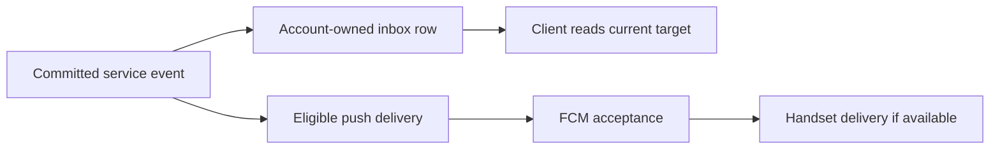

# Rider notification inbox

The commuter app's bell opens an account-owned inbox. These records are durable
facts about a ride, not a claim that Firebase displayed a push on a handset.
The API records only a kind, first-party target, timestamp and read state; it
does not copy passenger names, phone numbers, route labels, provider responses
or device tokens into notification records.

`GET /v1/me/notifications?limit=30&unreadOnly=false` returns newest first:

```json
{
  "data": [
    {
      "id": "26a51489-63b5-4c24-9d6f-e3f16d72d807",
      "kind": "seat_ask",
      "target": {
        "type": "reservation",
        "id": "08ed1605-1cd0-4571-af5b-c33b1c3c719e"
      },
      "createdAt": "2026-09-30T17:00:00.000Z",
      "readAt": null
    }
  ],
  "page": { "nextCursor": null }
}
```

This is a schema-valid _illustrative_ response, not a captured staging record.
Follow `nextCursor` unchanged and keep the same `unreadOnly` filter. The page
size is 1–100 (default 30). A cursor belongs to the current account and filter.
`POST /v1/me/notifications/{id}/read` returns the same notification with a
non-null `readAt`. It is idempotent; a different rider's ID returns 404.
`POST /v1/me/notifications/read` marks all unread rows and returns
`{ "data": { "readCount": 1 } }`. Neither mark-read call needs a request body.

The supported kinds are `seat_ask`, `seat_held`, `seat_unseated`, `ride_used`,
`credit_converted`, `trip_changed`, `trip_cancelled` and `standby_offered`. They come from committed
reservation prompts, status changes, credit conversions and trip events. A
unique `(rider, kind, source)` key prevents a replay from creating a duplicate.
Opening a reservation target fetches the current trip detail; a credit target
opens the wallet. A standby target opens the subscription request and offer.
The inbox never treats an old event as current trip state.

`GET /v1/me/notification-preferences` returns `data.dailyAskTime` (24-hour
Ghana local clock, 06:00 through 21:59), `data.optionalUpdatesEnabled`, `updatedAt`
and `version`, plus an `ETag` header. `PATCH` takes both settings and that
ETag in `If-Match`; missing is 428 and stale is 412. There is no global mute:
seat asks, seat results, boarding/credit receipts and trip changes remain
service notifications. `optionalUpdatesEnabled` defaults off; no optional
campaigns currently exist.

Staging schedules tomorrow's asks at 21:00 UTC and defaults at midnight through
the service-maintenance workflow. The preferred `dailyAskTime` is recorded but
does not change that shared schedule or guarantee delivery at that hour.
Push delivery requires a separate worker invocation; the ask job only records
the prompts. Proximity alerts are deferred until product approval and a
bounded once-per-trip design. Missing Firebase credentials do not block API
startup, the inbox, or tests; only the push worker requires them. No new push
delivery path was added by this inbox work.

## Bounded push delivery

`PushNotifications.drain(limit)` considers at most 100 queued deliveries per
run. Up to four accounts send concurrently (fewer if the database pool is
smaller), with each account's devices/events
processed serially. This is bounded concurrency, not a single multicast request:
each recipient retains its own notification and reservation identity.

The worker locks the account, delivery and device and rechecks eligibility before
sending. Accounts locked by another worker or account operation are deferred
without consuming a provider attempt. Device transfer, erasure, decided rides
and revoked driver sessions still prevent ineligible sends. FCM token refresh
is shared across concurrent sends rather than repeated for each recipient.

Each delivery keeps its own accepted, cancelled, failed or retry state. Only
explicitly unregistered tokens are revoked; transient failures use the existing
bounded retry policy. On a database error the run stops claiming new work and
waits for started transactions before failing. A provider acceptance followed
by a database/process failure can still lead to a repeated send on retry; this
is not an exactly-once delivery guarantee. Stable notification IDs are retained.

Measure pending age, run duration and provider errors before increasing worker
concurrency or adding infrastructure. The historical estimates in issue #160
refer to the retired backend and are not current capacity measurements.
See [schedules](../DEPLOY.md#scheduling),
[worker](../../services/api-next/src/notifications/push.ts) and
[delivery tests](../../services/api-next/tests/push.pg.test.ts).

## Event to inbox, and settings concurrency



The inbox and push are separate outcomes. Reading an inbox row must fetch the
current reservation/offer rather than trust stale notification text. A provider
acceptance or unread count does not prove a handset displayed a notification.
Not every inbox event implies a push is configured or supported.

Settings use optimistic concurrency: GET preferences and keep its ETag, then
PATCH both values with If-Match. On 412, refresh and let the user reconcile.
Keep pending/error state visible; do not display “saved” before success.
A minute-level value such as 18:30 must remain selectable.

Calls: [read/update settings](worked-examples.md#5-update-preferences-safely).
Code: [inbox and preferences](../../services/api-next/src/notifications/inbox.ts),
[preferences UI](../../apps/trotxi_commuter/lib/Features/Home/widgets/Tabs/profile_notification.dart).
Tests: [notifications](../../services/api-next/tests/notifications.pg.test.ts).
