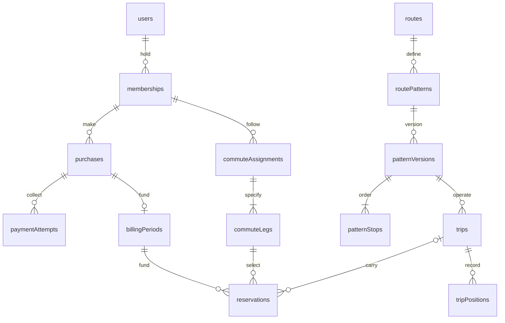

# Proposed database model and implementation plan

Status: design draft, not implemented or approved DDL.

Baseline: `43cdae0`, including merged geospatial PR #292.
Acceptance starting point: [behavioral invariants](database-redesign-invariants.md).
The payment inventory is complete for its 16 named Postgres tests; the other
domains still require their scenario-to-test inventory before schema approval.

## Decision

Redesign the models before launch around existing requirements: membership,
paid service, ops-reviewed commute changes, daily reservations, direction-specific
routes, driver GPS and auditable accounting. Preserve the agreed business rules
while changing storage, repositories and clients together.

Keep PostgreSQL/PostGIS, integer pesewas, transaction boundaries, idempotent
ledger entries, the provider inbox and the current test suite's scenarios.
Continue using R2 for the Ghana basemap and media, and Redis as a rebuildable
cache. This proposal does not introduce a new database engine, microservices,
recurring payment mandates, operator payouts or a standby marketplace.

## Core relationship map

Conceptual relationships only: supporting auth, audit, pricing, pause, refund,
hold and route-geometry tables are described below. Names are proposed.

The optional reservation-to-trip link preserves pending/unseated intent before
an actual run is assigned. Cross-domain ownership is enforced even when the
trip is absent. Active published assignments and patterns must have their
required legs/stops; drafting state may temporarily be incomplete.

## 1. Identity and access

Retain `users`, `auth_identity`, `sessions`, `device_tokens`, `drivers` and
`driver_credentials`. Enforce one non-null `drivers.user_id` per user. Drivers
may remain unlinked during provisioning. Credentials keep their independent
revocation and lockout lifecycle.

Keep the existing roles unless an accepted requirement calls for multiple
roles. Do not introduce organizational tenancy solely to make the model look
complete. Account erasure removes/scrubs relevant personal data and credentials;
historical accounting survives under a deliberate retention policy. A retained
UUID alone is not a claim that the remaining data is anonymous.

## 2. Membership, purchase and coverage

| Proposed entity      | Owns                                                                                                                                                    | Existing requirement                                                                        |
| -------------------- | ------------------------------------------------------------------------------------------------------------------------------------------------------- | ------------------------------------------------------------------------------------------- |
| `memberships`        | Rider ownership, membership creation/termination, continuity across renewals                                                                            | Existing subscription lifecycle                                                             |
| `purchases`          | Immutable agreed plan, price, currency, ride allowance, conversion rate, quoted route/stops, applied credit and cash due; purchase/fulfilment lifecycle | Freeze terms before contacting Paystack; distinguish an agreement from a collection attempt |
| `payment_attempts`   | Purchase reference, provider reference/transaction identity, environment, requested cash, settlement facts and verification state                       | Initialization failure, Verify recovery and retries                                         |
| `billing_periods`    | Purchase reference, coverage start, original end, effective end, close/reversal state                                                                   | Period-scoped entitlement and renewal history                                               |
| `period_adjustments` | Reason, actor/source, original/resulting deadlines and idempotent extension                                                                             | Preserve paid time through pause/resume                                                     |
| `membership_pauses`  | Rider consent, request, paused period, start/resume times                                                                                               | Optional pause while a transfer request waits                                               |

Purchase terms become fixed when checkout starts. The billing period references
those terms rather than repeating the same financial fields on membership and
period records. A failed purchase remains an explainable quote/attempt history.
Necessary provider cash facts are retained separately so actual collection can
be checked against the agreement; these are evidence, not a second mutable price.

One fulfilled purchase funds exactly one period. The authoritative link is
`billing_periods.purchase_id`, unique. Remove independently writable reverse
payment-period links. A current-period read is derived from the membership's
nonclosed period and coverage, with uniqueness and overlap checks; no second
writable `current_period_id` pointer is required.

Uniqueness removes duplicate purchase-to-period links; it does not establish
rider ownership. Derive ownership through the purchase/membership chain where
possible, and use composite ownership constraints wherever reservations,
attempts or other records also carry a rider or membership identifier. Reject
cross-rider links in direct Postgres tests of the replacement schema.

The current policy remains one unresolved purchase per rider and no checkout
that bypasses a current paid or disputed membership. Multiple attempt records
represent sequential retries after a terminal outcome, not permission to start
parallel collections. An uncertain initialization/Verify result stays unresolved.
Unexpected late success is reconciled explicitly, never used to silently grant
a second purchase or abandon captured cash.

There is one authoritative effective coverage deadline on the billing period.
Each extension records its reason and updates that deadline atomically; the
original promised deadline remains available. Membership has no duplicated
period dates or monetary fields.

## 3. Commute assignment and recurring service

| Proposed entity                                 | Owns                                                                                            | Existing requirement                                                       |
| ----------------------------------------------- | ----------------------------------------------------------------------------------------------- | -------------------------------------------------------------------------- |
| `commute_assignments`                           | Membership, effective-from/to dates, source purchase or approved change                         | Remember where the rider was assigned on each travel date                  |
| `commute_legs`                                  | Assignment, service window, directional pattern, pickup/drop-off occurrences, service selection | Represent morning and return travel separately                             |
| `service_schedules`                             | Pattern, explicit service window, Ghana departure time, operating dates and revision            | Match recurring preferences and runs without inferring direction from hour |
| `commute_requests` and `commute_request_events` | Requested change, consent, status and ops decisions                                             | Existing rider request/ops queue                                           |
| `commute_slots`                                 | Ops-released transfer quota and its held/allocated owner, covering the requested legs           | Last-slot contention and recurring transfer allocation                     |

The subscription API can expose the effective assignment without storing it on
the billing record. Applying an approved transfer ends the previous assignment
and creates the next one atomically. Historical reservations keep their original
assignment and stop occurrences. The paid period and agreed financial terms do
not change merely because the commute does.

Preserve the current transfer rules: submit does not apply; approve holds a slot;
ops explicitly applies on/after the effective date; pausing requires consent;
unsettled trips block unsafe changes; cancellation releases capacity. Transfer
slots remain an ops-verified quota, not a claim that initial subscription sales
have a complete fleet-capacity model.

Different or unknown transfer fares continue to require ops review. Do not add
automatic proration as part of normalization. Existing paired morning/return
behavior remains the baseline; separate leg records do not authorize a new
one-way product or more daily rides.

## 4. Routes, stop versions and actual trips

| Proposed entity           | Owns                                                                                                       |
| ------------------------- | ---------------------------------------------------------------------------------------------------------- |
| `routes`                  | Stable commercial corridor identity and archive state                                                      |
| `route_patterns`          | Stable directional path identity within a corridor                                                         |
| `route_pattern_versions`  | Published revision and effective interval of a pattern                                                     |
| `route_pattern_stops`     | Stop occurrences, ordered sequence and location/name snapshots for that published version                  |
| `route_geometries`        | Immutable learned/manual geometry revision, source and the pattern version it describes                    |
| `geometry_stop_distances` | Distance of each stop occurrence along that geometry revision                                              |
| `segment_speeds`          | Learned speed/sample count for a segment of a pattern version and service window, with geometry provenance |
| `trips`                   | Exact pattern version, explicit service window, schedule, vehicle, driver and actual run lifecycle         |
| `trip_assignment_events`  | Assignment/reschedule actor, time and before/after values                                                  |

Travel direction belongs to the pattern. Morning/evening describes the service
window. Moving a departure across noon must not change the direction or the
rider's intended journey. Commercial fares remain corridor-based unless a
separate pricing decision changes them.

Published stop order is immutable. Editing a path or stop arrangement publishes
a new version; completed trips retain their old version. Reference a stop
occurrence within a version, not an array offset or a globally unique stop
alone: a loop can visit the same physical stop twice.

This preserves occurrence identity but does not by itself fix ETA projection on
loops. The projection algorithm still needs traversal/progress context and tests
showing that a future occurrence is not mistaken for an already-passed one.

Geometry learning may improve an existing pattern version without changing its
published stops. Publish a geometry and its stop distances together; never join
distances from one revision to a different polyline. Keep speed aggregates scoped
to compatible patterns/segments and invalidate or recompute incompatible ones.

Assignments and schedules retain their applicable version information. A pattern
revision that removes a rider's stop needs an explicit reassignment decision;
silently substituting another stop is not a valid migration strategy.

## 5. Reservations, boarding and accounting

Reservations retain membership/rider ownership, funding period, assignment leg,
travel date/window and optional trip, plus the stop occurrences actually chosen.
Preserve one actionable reservation per rider/day/window under the current
product. Confirmation history and replacement bookings must remain explainable.

Boarding, code, QR, photo and no-show actions converge on one chargeable ride
outcome per reservation. Retain scan attempts as audit evidence separately from
the chargeable result. Preserve the existing availability posture until its
invariant review is complete; stronger atomicity must not silently change the
documented QR/offline fallback behavior.

Retain separate ride and credit ledgers. Give entries typed source references:
allocation to its funded period, consumption/return to its reservation,
conversion to a unique period-close record, reversal to its processed refund,
and compensation/loyalty to a recorded adjustment. Avoid arbitrary polymorphic
strings as the only connection to the source. Allow only the valid source
combination for each reason, including ownership constraints.

Use a unique `period_closures` record to tie removed unused rides and generated
credit together. It records the frozen rate and totals, including zero-value
closure. Entries remain append-only for the application role; corrections are
attributable reversals/adjustments. Do not introduce full operator double-entry
accounting before operator payouts are an approved implementation requirement.

Credit holds belong to a purchase and its rider. Reserve, capture and release
are distinct states; reconciliation must not release a hold merely because a
network call timed out. Available credit excludes holds. Refund recovery cannot
take credit already committed to another unresolved purchase.

## 6. Refunds, disputes and access state

Retain the durable webhook inbox, provider refunds, disputes and operations
reversal reviews, linked to exact payment attempts and purchases. Inbox events
may initially lack a resolved purchase; authenticate and persist the raw event,
then resolve it explicitly during processing.

Keep payment settlement, purchase fulfilment, period closure/reversal and access
blocks as separate concepts. Refund totals come from processed refund evidence;
a dispute resolution does not itself prove a refund.

Represent each independent access block with its scope and source. Payment
dispute blocks target the affected purchased period; voluntary pauses retain
their own consent and elapsed-time semantics. Membership reads aggregate these
facts for the API. Clearing one dispute clears only its own block, and never
reopens a reversed/expired period or overrides a different pause/block.

Handling an old purchase must not blindly rewrite the current purchase's state.
Whether an unresolved historical dispute should also impose an account-wide
restriction is a product decision; keep that question explicit in schema review.

## 7. Driver GPS and map delivery

Keep collection restricted to the assigned driver on an active trip. Store raw
device capture time separately from server receipt time, a stable client fix ID
and enough assignment provenance to explain who supplied the observation.
Make the capture-time normalization/clock-skew rule explicit and test it before
using normalized time for ordering and freshness. Preserve the original times.

Tie observations to trips and therefore exact directional pattern versions.
Maintain a latest-position projection atomically so concurrent uploads cannot
move the live marker backwards; Redis reflects that projection and remains
rebuildable. Require a stable client fix ID and enforce uniqueness on
`(trip_id, client_fix_id)`; the replacement model needs no nullable legacy IDs.

Publish learned geometry/speed results before eligible raw traces are pruned.
Retention duration and deletion scheduling remain explicit decisions; archive
protection must not mean keeping raw driver locations indefinitely.

The commuter app renders the R2 basemap, route geometry, selected stops and bus
position. No commuter GPS collection is introduced. Proposed read policy is
eligible membership on the relevant corridor, plus assigned-driver/admin access;
confirm paused/disputed and pre-booking visibility before enabling it. A UUID
alone does not authorize access.

## 8. Database-enforced and transaction-enforced rules

- Ownership constraints tie rider, membership, purchase, period and reservation
  together. Where redundant owner IDs enable composite foreign keys, every copy
  is constrained rather than independently editable.
- A current membership, unresolved purchase and open funded period cannot be
  duplicated under the existing policy. Published assignment/version intervals
  cannot overlap where the product expects one effective choice.
- Pickup/drop-off occurrences belong to the selected pattern version, with valid
  order in that direction. A trip's progress occurrence belongs to its version.
- Required purchase terms cannot be null for a fulfilled purchase. Monetary
  units, nonnegative amounts and cash-plus-credit arithmetic are explicit.
- Protect financial and operated-trip history with restrictive deletes and
  archival behavior. Apply archive filtering to new choices/dispatch, while
  historical reads continue to resolve archived parents.
- Use transactions and locks for cross-row conditions such as seat capacity,
  safe close versus boarding, period creation plus fulfilment, and last-slot
  approval. Foreign keys and CHECKs alone cannot enforce those workflows.
- Install the replacement schema from a clean migration baseline, recording
  content hashes from its first migration. Preserve the old chain in Git and
  the isolated test baseline, not in the replacement schema. Subsequent new
  migrations are forward-only. Use a single migration writer and a distinct
  runtime role with narrower rights.

## API and implementation model

The [API redesign proposal](api-redesign-proposal.md) defines proposed versioned
endpoint families, composed read models, authorization, errors, retry semantics
and client rollout. Review it together with this schema; API contracts are a
first-class redesign deliverable, not something deferred until app integration.

Design task-oriented response shapes without promising compatibility with the
existing endpoints. Internal tables do not dictate public representations.
Replace the OpenAPI contract and generated clients together, including trip
direction, pattern versions and pickup/drop-off occurrence identifiers.

Expose membership status, paid coverage, commute assignment and independent
block reasons as distinct fields. A coverage end is not a promised automatic
charge: renewal remains rider-initiated. Avoid calling it an automatic renewal
date while there is no payment mandate.

Domain operations own transaction boundaries: quote/reserve, verify/fulfil,
settle reservation, close period, apply refund, resolve dispute, apply commute
change and publish route version. Repositories persist these operations without
independent copies of the business state machine in every adapter. A shared
behavioral harness must exercise real Postgres as well as any in-memory test
implementation.

Stage 1 includes a complete current-to-target endpoint inventory and contract
review. Stage 2 includes isolated HTTP test adapters and generated-client
feasibility checks. Implement the replacement backend and update all consumers
before a coordinated staging cutover. No legacy aliases, response adapters,
dual writes, per-record model routing or transitional columns are required.

## Implementation sequence

| Stage                           | Deliverable and exit criteria                                                                                                                                                                                                                  |
| ------------------------------- | ---------------------------------------------------------------------------------------------------------------------------------------------------------------------------------------------------------------------------------------------- |
| 1. Rules, schema and API review | Finish non-payment invariant inventory and executable contract design; settle policy questions. Map every entity and endpoint to a requirement. Review the clean cutover plan.                                                                 |
| 2. Verification harness         | Prove the pinned implementation against PAY-01 through PAY-16 and non-payment scenarios, with meaningful negative controls. Prepare clean-schema migration tooling and client-generation feasibility checks.                                   |
| 3. Replacement backend          | Implement versioned transport, membership/purchases/periods, typed accounting, commute/boarding and GPS provenance in the new schema. Enforce ownership, uniqueness and transaction rules. Pass preservation and target-only integrity suites. |
| 4. Consumer integration         | Generate the replacement client and update rider/driver apps, ops consumers, scripts and jobs. Update seeds, ERD, ADRs and runbooks. No consumer relies on removed endpoints.                                                                  |
| 5. Full rehearsal               | Exercise both mobile platforms and full purchase, renewal, pause, transfer, boarding, GPS, refund/dispute and recovery journeys against a clean installation. Verify contract and accounting results.                                          |
| 6. Coordinated staging cutover  | Stop old writers/jobs, install the new schema and deploy the matching backend and consumers together; explicitly approve any fixture reset/reseed. Run smoke tests and reconciliation before enabling scheduled work.                          |

The harness is specified in
[differential verification design](database-redesign-harness.md). Stage 2 must
prove it observes the old implementation correctly before a new implementation
is available. Passing only the redesigned implementation is not the comparison
gate. Missing databases or skipped required scenarios must fail that gate.

Use reviewable PRs on an integration branch without deploying a half-replaced
system. Transport and payment work can proceed independently once shared
identifiers/contracts are agreed, but commute and boarding integration must
prove the complete model. Client work starts during contract review, not at
cutover; coordinate with its actual owners.

The planning premise is prelaunch with zero users. Do not retrofit relationships
that the target model removes or build a legacy-support program. Keep the old
implementation only in Git and disposable test infrastructure. This design
does not itself authorize erasing any database.

## Rollout, abort and recovery

### Deployment contract

Use one coordinated staging cutover to the clean schema and replacement API.
There is no old/new aggregate ownership marker, dual writer or deployed adapter.
Two schemas coexist only in isolated harness databases, never as competing
staging models.

The runbook names the exact target database, matching backend/client revisions,
workers and schedulers to stop, clean install/reseed commands, validation queries
and recovery procedure. Confirm fixture contents and approval before resetting;
preserve a snapshot if any fixtures need to be retained. Stop all old writers
before activating the replacement system.

Reconcile or explicitly retire outstanding sandbox payment fixtures before
cutover. Late provider events referencing old fixtures must be quarantined for
inspection, never guessed into new purchases. Keep identifiers collision-safe
and test this boundary; a fresh database does not clear Paystack's event history.

### Failure before new writes

Keep the replacement offline and correct the installation. A failed
transactional migration must not be recorded as applied. If an old disposable
environment was retained, a whole-environment return to its matching build is
possible before new writes; do not run the old binary against the new schema.

### Failure after new writes

Stop affected writes and faulty workers, preserve evidence and fix forward.
Do not restore old binaries against new records. If all affected data is
confirmed disposable, an explicitly approved clean reset/reseed is an option,
not a substitute for understanding and testing the defect.

Keep authenticated webhook receipt durably available while money processing is
paused. If durable persistence is unavailable, do not acknowledge success;
provider retry plus later Verify reconciliation remains necessary. Do not
release holds, synthesize refunds or mark transactions failed simply because
processing is paused. External Paystack facts are not rolled back with database
state.

An application rollback is permitted only to a tested revision that understands
the current schema and all records already written. Otherwise use a fix-forward
deployment. Financial corrections use attributable adjustment/reversal entries;
never rewrite ledger history to make it resemble an earlier snapshot.

### Recovery exit criteria

Before resuming writes, rerun the affected invariant suite, invalid-link checks,
accounting/hold reconciliation and idempotent replay of queued events. Check for
partial changes and verify old workers remain stopped. Rehearse after new writes,
including a payment awaiting provider delivery and a trip/commute in progress.
A snapshot restore does not undo provider events; reconciliation is required
after any restore or reset of provider-connected fixtures.

## Decisions to settle in review

1. Is an old unresolved dispute period-scoped or an account-wide service block?
2. Who may see live bus positions before booking, while paused, or while disputed?
3. How should an approved route version change affect existing recurring riders
   whose stop disappears, and existing scheduled-but-unstarted trips?
4. What is the driver-trace retention period and acceptable clock-skew behavior?

Do not invent new answers for existing unresolved pricing questions: different
fare transfers remain blocked for review, entitlement counts and commercial
rates remain configurable, and renewals remain explicit rider purchases.
