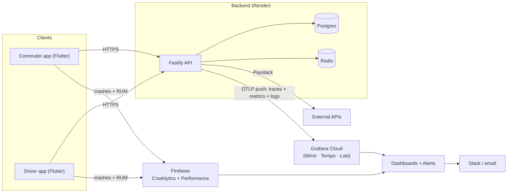

# Observability & performance design

**Owner:** Godfred Awuku · **Date:** 2026-06-28 · **Status:** ✅ **backend live on staging** — Phases 0–2 (metrics + traces + logs → Grafana Cloud, correlated). Pending: Phase 4 (SLO dashboards/alerts) + Phase 3 (mobile RUM, FE lane). Tooling **decided: free-tier only**. (#28)

How we measure and protect the **latency, memory, responsiveness, and
reliability** of every part of Trotxi — the Fastify API, its dependencies
(Postgres, Redis, Paystack), and the two Flutter apps (commuter + driver). The
goal: know our health from real signals, catch regressions before users do, and
debug incidents in minutes, not hours.

This is a design, not a build. It defines _what_ we measure, _how_, _to what
targets_, and _in what order_ — keeping cost near-zero for the pilot.

---

## 1. Goals & non-goals

**Goals**

- One coherent picture across **backend, mobile, and infra** — not three silos.
- The four signals the business cares about, each with a measurable SLI and a
  target SLO: **latency, memory, responsiveness, reliability**.
- **Vendor-neutral instrumentation** so we can change tooling without re-wiring
  the code.
- **Cheap** — free tiers first; spend only when scale demands it.
- **Safe** — no PII or secrets in telemetry (a money product under Act 843).

**Non-goals (for now)**

- A full SRE on-call rotation (it's the CTO until the team grows).
- Self-hosting a metrics stack (managed free tiers beat ops toil at our size).
- Business analytics / funnels (that's product analytics, a separate concern).
- **Paying for observability tooling.** Free tiers only. We pay for **DB,
  Paystack, and cloud hosting** — nothing else. If a tool nears a paid threshold,
  we revisit rather than auto-upgrade.

---

## 2. The four signals → what we actually measure

| Signal             | Backend (API + deps)                                                                                | Mobile (Flutter apps)                                                                       |
| ------------------ | --------------------------------------------------------------------------------------------------- | ------------------------------------------------------------------------------------------- |
| **Latency**        | request duration per route (p50/p95/p99); DB query time; Paystack call time                         | time-to-first-screen, screen transition time, API round-trip _as seen by the device_        |
| **Memory**         | process RSS/heap, GC pauses, **event-loop lag** (Node's real "are we keeping up")                   | app memory (Android vitals / iOS), OOM/low-memory terminations                              |
| **Responsiveness** | p95/p99 duration + saturation (is the API still snappy under load?)                                 | **frame render times** — slow (>16ms) & frozen (>700ms) frames = jank; cold/warm start time |
| **Reliability**    | error rate (5xx / total), per-endpoint success rate, uptime, **payment-webhook processing success** | **crash-free sessions & users**, ANR/freeze rate, API call success rate                     |

We frame backend services with **RED** (Rate, Errors, Duration) and resources
(DB, Redis, host) with **USE** (Utilization, Saturation, Errors). Mobile uses
**RUM** (real-user monitoring): crashes + performance traces from real devices.

---

## 3. Architecture

**Instrumentation standard: [OpenTelemetry](https://opentelemetry.io/) (OTel).**
One vendor-neutral API for metrics, traces, and logs on the backend. Auto-
instrumentation exists for Fastify, `pg`, `ioredis`, and outbound `http` — so we
get traces across `request → DB/Redis/Paystack` with little custom code, and we
can repoint the exporter at a different backend later without touching app code.

**Correlation is the point.** A single `request_id` (and the OTel `trace_id`)
flows through structured logs → traces → metric exemplars, so from a slow p99 on
a dashboard we can jump to the exact trace and its logs.

---

## 4. Backend (Fastify API)

Build on what already exists: **pino structured logging** and the `/healthz` +
`/readyz` endpoints (the latter already pings DB + KV).

- **Metrics** — expose `GET /metrics` (Prometheus format via `prom-client`):
  - RED histograms per route+method+status (`http_request_duration_seconds`).
  - Node runtime: heap/RSS, **event-loop lag**, GC, active handles
    (`prom-client` default metrics).
  - Domain counters: payments initialized, webhook events processed/failed,
    rate-limit rejections, sign-ins.
  - **Shipped to Grafana via OTLP push** (no scraper/agent): the OTel SDK exports
    HTTP RED + Node runtime metrics over the same OTLP endpoint as traces. The
    `prom-client` `/metrics` endpoint stays for local/debug pull.
- **Traces** — OTel SDK auto-instruments Fastify/pg/ioredis/http; spans for
  `request → query → Paystack`. Head sampling (e.g. 10–20%), but keep **100% of
  errors**.
- **Logs** — pino JSON to stdout (Render captures) **and shipped to Loki via
  OTLP**; `trace_id`/`span_id` are injected into every line (pino instrumentation)
  so logs ↔ traces correlate in Grafana. Fastify's default serializers log no
  request bodies or headers, so nothing sensitive (auth tokens, `/payments/*`
  bodies) reaches the log pipeline.
- **Health** — keep `/healthz` (liveness) and `/readyz` (readiness); Render and an
  external uptime check both probe them.

`/metrics` must not be public — bind it to an internal path/token (it leaks
internal shape otherwise).

---

## 5. Front end (Flutter apps)

Owned by the FE devs (adomfosugit + team), to this design.

- **Crashes / reliability — Firebase Crashlytics:** crash-free sessions & users,
  stack traces tied to releases, non-fatal error reporting.
- **Performance / responsiveness — Firebase Performance Monitoring:** automatic
  app-start time, screen rendering (slow & frozen frames = jank), and **HTTP
  request traces from the device** (the real latency a user feels, network
  included — which server-side metrics can't see).
- **Custom traces** for the flows that matter: sign-in, top-up checkout, board.
- **Memory:** Android vitals (Play Console) + Firebase for low-memory/OOM; iOS
  via Xcode Organizer.

The device view is essential: server p95 can be 200ms while a user on a weak
3G link waits 4s. We must measure both ends.

---

## 6. Infrastructure & dependencies

- **Render:** built-in CPU/memory/instance metrics + deploy events; an external
  uptime monitor (e.g. Better Stack / UptimeRobot free) hits `/healthz` so we
  catch a fully-down instance Render might not alert on.
- **Postgres:** connection-pool saturation, slow queries (`pg_stat_statements`),
  error rate — surfaced via the API's DB spans + Render's DB metrics.
- **Redis:** hit/miss, latency, evictions, availability (the rate-limiter and KV
  depend on it; it **fails open**, so degradation must be _visible_ even when not
  user-facing).
- **Paystack:** outbound call latency + error rate, and a **webhook-lag** metric
  (a `charge.success` that stays unprocessed is a money incident).

---

## 7. SLIs & SLOs (starting targets — calibrate after baseline)

Measured in **production**, over a 28-day rolling window. These are first drafts;
tune once we have real traffic.

| Area                       | SLI                                       | SLO (target)                                |
| -------------------------- | ----------------------------------------- | ------------------------------------------- |
| API availability           | successful / total requests (non-5xx)     | **≥ 99.5%**                                 |
| API latency (reads)        | server-side request duration p95          | **< 300 ms** (p99 < 800 ms)                 |
| API latency (payment init) | duration p95 (calls Paystack)             | **< 1.5 s**                                 |
| API errors                 | 5xx rate                                  | **< 0.5%**                                  |
| Event-loop lag             | p99                                       | **< 70 ms**                                 |
| Memory                     | RSS vs instance limit                     | **< 80%**, no sustained upward (leak) trend |
| Payment webhook            | `charge.success` processed within         | **< 2 min**, 100% eventually                |
| Mobile reliability         | crash-free **users**                      | **≥ 99.7%** (sessions ≥ 99.5%)              |
| Mobile start               | cold start p90                            | **< 2.5 s**                                 |
| Mobile rendering           | slow frames                               | **< 5%** (frozen < 0.1%)                    |
| Mobile→API                 | request success rate (excl. user-offline) | **≥ 99%**                                   |

Each SLO gets an **error budget**; we alert on **burn rate**, not raw thresholds,
to cut noise.

---

## 8. Alerting

Two tiers, prod only (staging is dashboards-only):

- **Page (act now):** API down (`/health` failing), 5xx error-rate spike / fast
  SLO burn, **payment webhook backlog**, Postgres unreachable, memory near limit.
- **Notify (look soon):** latency SLO slow-burn, elevated rate-limit rejections,
  Redis degraded (fail-open masking it), crash-free dipping toward its SLO,
  dependency-audit/cert warnings.

Channel: a Slack `#alerts` channel + email; on-call = CTO for now. Every alert
links to the dashboard and a one-line runbook ("what this means / first check").

---

## 9. Tooling — decided (free-tier only)

Optimised for **$0 at pilot scale**, standard SDKs, and a clean upgrade path.

| Layer                       | Recommended                                    | Why                                                                                                  | Alternatives                                                                            |
| --------------------------- | ---------------------------------------------- | ---------------------------------------------------------------------------------------------------- | --------------------------------------------------------------------------------------- |
| Instrumentation             | **OpenTelemetry**                              | vendor-neutral; auto-instruments our stack                                                           | (none — it's the standard)                                                              |
| Backend metrics/traces/logs | **Grafana Cloud free tier** (Mimir/Tempo/Loki) | managed, generous free tier, one place for all three                                                 | self-host Prom+Grafana+Loki+Tempo; Better Stack; Axiom; Datadog/New Relic (paid, later) |
| Mobile RUM + crashes        | **Firebase Crashlytics + Performance**         | free, best-in-class for Flutter frame/jank/start metrics; likely already in the project for FCM push | Sentry (mobile)                                                                         |
| Error tracking (optional)   | **Sentry** (FE + BE)                           | unifies error grouping + release health both ends; good free tier                                    | rely on Crashlytics (mobile) + logs/Grafana (backend) to save a tool                    |
| Uptime                      | **Better Stack / UptimeRobot** free            | independent external probe of `/health`                                                              | Grafana Synthetic Monitoring                                                            |

**Decided (2026-06-28): free-tier only — OTel → Grafana Cloud (backend) +
Firebase (mobile).** Covers all four signals across both ends at **$0**. We pay
only for DB, Paystack, and cloud hosting — no paid observability tooling.

- **Grafana Cloud** managed free tier (not self-hosted) — avoids running extra
  paid services on Render.
- **Sentry deferred** — Crashlytics (mobile) + Grafana/logs (backend) already
  cover errors; revisit only if a real gap appears (it, too, has a free tier).
- **Cost guardrail:** stay inside free limits via **sampling + short retention**;
  if usage nears a paid threshold, **alert and revisit — never auto-upgrade**.
  A paid APM (Datadog/New Relic) stays a deliberate, later choice only if scale
  demands it.

### Why managed free tiers, not an in-house stack (yet)

A dashboard is the easy ~10%; the costly ~90% is what sits under it — a
**time-series DB** (ingest/retain/query), a **query engine** (compute p95s over
millions of points), a **24/7 alerting engine**, and, for mobile, a **crash SDK +
symbolication**. "Build our own dashboards" still needs all of that first.

- **Grafana is the in-house dashboard tool** — open-source; we author our _own_
  custom dashboards in it. Grafana Cloud is just **free managed hosting** of it +
  the storage. So this _is_ "our dashboards", minus running the database.
- **Firebase** is the genuinely hard-to-replace piece (on-device crash SDK +
  symbolication + frame/RUM collection) — not a dashboard.
- **Self-hosting now would cost _more_:** eng-weeks + ongoing ops + actual Render
  hosting spend — which breaks the free-tier + small-team constraints.
- **No lock-in (the key):** because we standardise on **OpenTelemetry + the
  Prometheus format**, the data is ours. A self-hosted stack — or a custom
  **admin/status dashboard in the Trotxi app** — can later point at the _same_
  data with no re-instrumentation. **Deferred option, kept open**, to revisit only
  if scale makes a paid tier costlier than running our own.

---

## 10. Privacy & security

A money app — telemetry must not become a leak:

- **Scrub PII & secrets** from logs/traces: never JWTs/refresh tokens, Paystack
  keys/signatures, phone numbers, emails, or full request bodies on auth/payment
  routes. Allowlist fields rather than blocklist.
- **Sampling** keeps cost _and_ exposure down; errors sampled at 100%, the rest
  low.
- **Retention** kept short (e.g. 14–30 days) and the backend region chosen
  deliberately (data residency).
- `/metrics` is **not public**.
- Reuses our existing guards: gitleaks (no secrets in code), structured logging
  already in place.

---

## 11. Rollout (phased, cheapest value first)

| Phase                                        | Scope                                                                                                                                                                                                                                                                                              | Outcome                                                          |
| -------------------------------------------- | -------------------------------------------------------------------------------------------------------------------------------------------------------------------------------------------------------------------------------------------------------------------------------------------------- | ---------------------------------------------------------------- |
| **0 — Foundation** ✅                        | pino structured logs, `/healthz` + `/readyz`, `request_id` + `trace_id`/`span_id` correlation                                                                                                                                                                                                      | clean, correlatable logs                                         |
| **1 — Backend metrics** ✅                   | `/metrics` endpoint (`prom-client`, local) **+ metrics pushed via OTLP** (HTTP RED + Node runtime: event loop, GC, heap) — no scraper/agent needed. **Remaining:** dashboards + 2–3 alerts (error rate, p95, memory)                                                                               | latency + memory + reliability visible (satisfies #28's RED ask) |
| **2 — Tracing + logs** ✅                    | OTel SDK + auto-instrumentation (HTTP/Fastify/pg/ioredis/pino) → traces, metrics **and** logs pushed via OTLP (gated by `OTEL_EXPORTER_OTLP_ENDPOINT`); pino logs carry `trace_id`/`span_id` (logs ↔ traces correlate). **Remaining (polish):** sampling tuning (head sample, keep 100% of errors) | debug slow requests end-to-end; pivot trace ↔ logs               |
| **3 — Mobile RUM** ⬜ _(FE lane)_            | Firebase Crashlytics + Performance in both apps; custom traces (sign-in, top-up, board); crash-free SLO                                                                                                                                                                                            | responsiveness + reliability from real devices                   |
| **4 — SLOs & alerting** 🟡 _defined as code_ | dashboard + alert rules committed in [`ops/grafana/`](../../ops/grafana/README.md) (RED + runtime, SLO thresholds); **remaining:** import into Grafana + wire the notification channel                                                                                                             | budget-driven, low-noise alerting                                |

Phases 0–2 are **live on staging** (verified: `/readyz` traces show the parent
request + `pg` child spans; metrics + logs flowing). Next: **Phase 4** (build the
SLO dashboards + alerts on the data now arriving) and **Phase 3** (mobile, FE lane).

---

## 12. Ownership & relationship to the rest of the system

- **CTO** owns backend + infra observability (phases 0–2, 4).
- **FE devs** own mobile instrumentation (phase 3) to this design.
- The deferred **Go telemetry service + MQTT** (real-time vehicle positions) will
  adopt the same OTel standard when it lands — the design scales to it.
- Fulfils issue **#28**; the stack decision is recorded in
  [ADR-0012](../adr/0012-observability-otel-grafana-firebase.md) (OpenTelemetry +
  Grafana Cloud + Firebase, free-tier).

## 13. Operating it — viewing telemetry in Grafana

Live on the **staging** Grafana Cloud stack. Enabled by two env vars on the
Render API service (`sync: false`): `OTEL_EXPORTER_OTLP_ENDPOINT` +
`OTEL_EXPORTER_OTLP_HEADERS` — **one** OTLP endpoint + token carries traces,
metrics, and logs. Unset → telemetry is a no-op (dev/tests).

In Grafana → **Explore**, choose the data source:

- **Traces (Tempo)** — `…-traces`. Search **Service Name = `trotxi-api`**, or
  TraceQL `{ resource.service.name = "trotxi-api" }`; narrow to an endpoint with
  `{ span.http.target = "/readyz" }`. Expand a trace for the span waterfall
  (request → `pg`/`ioredis` child spans); each span has a **"Logs for this span"**
  jump.
- **Metrics (Prometheus)** — `…-prom`. Request rate/latency from
  `http_server_request_duration_*`; memory/event-loop from `nodejs_*` /
  `process_*`; filter `service_name="trotxi-api"`.
- **Logs (Loki)** — `…-logs`. `{ service_name="trotxi-api" }`; every line carries
  `trace_id`/`span_id`, so you can pivot logs ↔ traces.

Locally, `GET /metrics` (prom-client) still serves a pull endpoint — open in dev,
token-gated and disabled in production.

## Related

- [ADR-0010 — KV/Redis](../adr/0010-kv-redis.md) (a fail-open dependency to watch)
- [authentication.md](../features/authentication.md) · [payments-and-wallet.md](../features/payments-and-wallet.md) (sensitive routes — no body logging)
- `strategy/security.md` (PII handling, Act 843)
