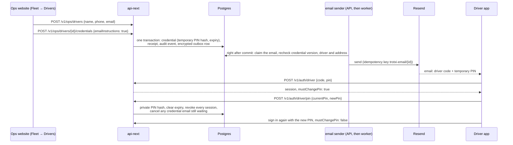

# Driver onboarding and PIN recovery

How operations brings a driver onto Trotxi and gets them back in when they
forget their PIN. Everything here runs through the existing driver credential
service: there is one way to sign in as a driver (driver code plus six-digit
PIN), and this adds email delivery and a mandatory private PIN to it.

## The flow



1. **Create.** In Ops, Drivers → Add driver. Name is required. The email is
   where sign-in instructions go. It is not a sign-in method and never becomes
   the account's email (`app.users.email`), which belongs to a verified Google
   or Apple identity.
2. **Issue.** "Issue a driver code and temporary PIN now" is on by default in
   the create dialog, and "Email the sign-in instructions" is on when there is
   an address. If creating works but issuing fails, the dialog keeps the
   created driver and "Retry sign-in details" repeats only the issue, with the
   same idempotency key. The driver is never created twice.
3. **Sign in.** The driver signs in with the code and temporary PIN, confirms
   the account is theirs, and is taken to **Choose your PIN**.
4. **Private PIN.** Six digits, not one digit repeated, not a run up or down
   (the server's rule, checked in the app first). Saving signs out every
   device, this one included, and the driver signs in with the new PIN.

## Staging setup

Create test drivers and issue or reset their sign-in details through
**Ops > Drivers**, using the same temporary-PIN lifecycle as other drivers.
The entire staging seed script and its manual GitHub Actions workflow have
been removed, including catalogue seeding, trip extension, identity linking,
bulk enrolment, account inspection and PIN resets. Use the supported Ops and
commuter workflows instead. Existing staging data is not deleted.

The scheduled payments/email workflow remains. Its payment step now runs
`scripts/maintain-staging-payments.ts`, which uses an existing administrator
for a short-lived session, processes the inbox and reconciliation jobs, and
revokes the session afterward. It cannot create an administrator or seed data.
Logs contain only job names, HTTP statuses and allowlisted batch counts.

Removing this tooling does not revoke existing PINs or remove old Actions
logs. Treat any driver credentials previously printed there as exposed. Reset
affected drivers through Ops, which also revokes their sessions, and remove
the affected historical workflow logs as a separately approved cleanup.

## What a temporary PIN can do

A temporary PIN is any PIN operations issued: at first issue or on a reset.
`driver_credentials.must_change_pin` marks it and `temporary_pin_expires_at`
bounds it; a database constraint keeps the two together.

| Rule                       | Where it is enforced                                                                                                                                                            |
| -------------------------- | ------------------------------------------------------------------------------------------------------------------------------------------------------------------------------- |
| Expires after **72 hours** | Sign-in refuses it with `403 temporary_pin_expired`, checked only once the PIN is right. The PIN change refuses it the same way.                                                |
| Reaches setup only         | Session authorization: `GET /v1/me`, `GET /v1/driver/me` and `POST /v1/auth/driver/pin` work; everything else, including trips, boarding and GPS, is `403 pin_change_required`. |
| Survives app restarts      | The rule is on the server, so a restored or refreshed session is held to it too. The app sends a restored temporary-PIN session back to PIN setup.                              |

72 hours covers an email read the next working day without leaving an unread
email as a standing credential. It is a credential expiry. The five-minute
window on credential receipts is something else: it only limits how long ops
can re-read an issue or reset response with the same idempotency key.

Drivers who already had an operations-issued PIN when migration 029 ran were
given 72 hours from the upgrade.

## Recovery (Forgot PIN?)

There is no self-service reset. Nothing on a driver record is a verified
channel, so a code sent to it would trust whoever holds the phone, and no
public endpoint resets an account because someone knows its code or address.

1. Signed out, the driver taps **Forgot PIN?**. The page shows the operator
   contact published in `/flags` and asks them to give their name, driver code
   and the phone number on their record.
2. Operations confirms who they are, then Drivers → Manage → **Reset PIN and
   email instructions**, with a reason. The reason is kept in the audit log.
3. The reset replaces the PIN, starts a new 72-hour window, signs out every
   session, and cancels any credential email still waiting. A suspended driver
   stays suspended: reset never reactivates.
4. The driver signs in with the new temporary PIN and chooses a private one.

Operations never sees a driver's chosen PIN. PINs are stored as keyed one-way
hashes, so nobody can read one back, operations included.

## Delivery states

The Ops driver panel and People → Delivery status show the latest sign-in
email. None of these states means the email reached an inbox; there is no
delivery confirmation to report.

| State               | Meaning                                                                                                                                                                                       | What to do                                              |
| ------------------- | --------------------------------------------------------------------------------------------------------------------------------------------------------------------------------------------- | ------------------------------------------------------- |
| `queued`            | In the outbox, waiting for the email worker. Not sent.                                                                                                                                        | Run or schedule the worker (below).                     |
| `provider_accepted` | Resend accepted it. Not proof of delivery.                                                                                                                                                    | If the driver has nothing after a while, reset the PIN. |
| `cancelled`         | `stale_credential`: a reset, PIN change, address change or archive made it obsolete before it was sent. `account_closed`: the account was erased. `expired`: the temporary PIN window passed. | Nothing, or reset if the driver still needs a PIN.      |
| `failed`            | Resend rejected it (`provider_rejected`), usually a bad address.                                                                                                                              | Correct the address, then reset the PIN.                |
| `unknown`           | No answer from Resend within its 23-hour idempotency window after 20 attempts.                                                                                                                | Reset the PIN; do not try to resend.                    |

Old sign-in details are never resent. If an email did not arrive, reset the
PIN: that cancels the old message and emails a new temporary PIN. A resend of
the old message could deliver a PIN that has since stopped working, or reach
an address that has since changed.

## How the email is kept safe

- The temporary PIN exists in plaintext only in the issue/reset response, which
  the Ops page shows once when it was not emailed and never holds when it was,
  and inside the encrypted outbox payload (AES-256-GCM, key derived from the
  existing device root key, bound to the row id). It is not in the outbox row,
  the credential receipt, the audit event or any log.
- The outbox row is queued in the same transaction as the credential change. A
  rollback leaves neither. A replayed command returns the receipt it already
  wrote and queues nothing.
- Before sending, the worker locks the user, then the driver and credential,
  and sends only if the credential version, driver, linked account and address
  still match what the message was written for, and the temporary PIN has not
  expired. Otherwise it cancels with `stale_credential`.
- The payload is scrubbed as soon as the message is accepted, cancelled or
  fails. The message expires with the PIN it describes.
- Staging messages are marked `[STAGING TEST]` and say they are for a staging
  test account.
- The email names no app download link or support address. None is configured
  anywhere to point at, and the app's own "Forgot PIN?" page shows the
  operator contact from `/flags`.

## When the email goes out

Straight away, in the normal case. Once the issue or reset has committed, the
API sends that one message in the background; operations does not wait for
it. It goes through the same claim, recheck and retry path as the worker, so a
message made obsolete in the meantime is cancelled rather than sent.

The email worker is the safety net for anything that first attempt misses:
Resend unavailable, a timeout, or the API restarting mid-send. Those stay
queued with their retry time. The existing GitHub Actions payments/email
maintenance schedule retries up to 100 due outbox messages every 15 minutes
once this branch is merged into the default branch. GitHub may delay runs.
It reuses the existing staging database secret and the current Render
integration: no new secrets or paid service. The staging master key is read
and used only inside the workflow's key step, which derives the outbox key
there; only that derived key and the Resend key reach the email step, as
masked step outputs, and nothing is written to the job-wide environment. If
the staging API has no `RESEND_API_KEY`, the email step skips with a notice
instead of failing. Payment-job failure does not skip email retries. Logs contain
counts only; the existing expiry, stale-credential checks and provider
idempotency keys apply. This schedule only retries queued messages; it does
not prepare new subscription reminders.

For a manual run (which also prepares due subscription reminders):

```sh
node dist/worker.js emails
```

It prepares due subscription reminders, then drains up to 100 pending emails,
driver credentials included. Rerun it while `considered` is 100. It needs
`RESEND_API_KEY` on the service; without it, the API refuses
`emailInstructions: true` with `503 email_unavailable` rather than queue a
message nothing will send.

**Manual staging operation.** From the staging API service's shell on Render,
run the command above. It sends real, staging-labelled email to whatever
addresses are queued, so only run it with the driver's agreement and a real
test address.

## Contract

All fields are additions; no operation was added.

| Where                                                            | Field                                                                                                                                           |
| ---------------------------------------------------------------- | ----------------------------------------------------------------------------------------------------------------------------------------------- |
| `DriverInput`, `DriverEdit`, `Driver`                            | `email`: contact address, nullable                                                                                                              |
| `Driver` (ops list)                                              | `credential {driverCode, status, mustChangePin, temporaryPinExpiresAt, lockedUntil}`, `credentialEmail {purpose, state, failureCode, queuedAt}` |
| `CredentialIssue` (`POST /v1/ops/drivers/{id}/credentials`)      | `emailInstructions?: boolean`                                                                                                                   |
| `PinResetInput` (`POST …/credentials/reset-pin`)                 | `reason`, `emailInstructions?: boolean`                                                                                                         |
| `CredentialSecret` (both responses)                              | `temporaryPinExpiresAt`, `email {id, to, state: "queued"}` or null                                                                              |
| `DriverTokens` (`POST /v1/auth/driver`), `DriverSelf.credential` | `temporaryPinExpiresAt`                                                                                                                         |

New error codes: `pin_change_required` (403), `temporary_pin_expired` (403),
`driver_email_missing` (409), `email_unavailable` (503).

Issue with email (fictitious values):

```http
POST /v1/ops/drivers/6f1c…/credentials
Idempotency-Key: 5b0e0c52-…
X-Trotxi-Client: ops

{ "emailInstructions": true }
```

```json
{
  "data": {
    "code": "DR-7K9Q",
    "pin": "481205",
    "temporaryPinExpiresAt": "2026-09-29T08:00:00Z",
    "email": { "id": "0d9e…", "to": "ama.driver@example.test", "state": "queued" }
  }
}
```

A temporary-PIN session reaching for work:

```http
GET /v1/driver/trips
Authorization: Bearer eyJ…
X-Trotxi-Client: driver
```

```json
{ "error": { "code": "pin_change_required", "message": "Set your own PIN before you continue." } }
```

## Verified, and not

Verified locally:

- Postgres tests DRV-30 to DRV-39: onboarding, replay, rollback, missing and
  unconfigured email, plaintext absence, stale cancellation (reset, PIN change,
  address change, version race, erasure), setup enforcement including a
  refreshed session, expiry, authorization including passkey elevation,
  retries with the same provider idempotency key, and upgrade from 028.
  Removing the worker's recheck makes DRV-34 fail.
- Ops: create and onboard, partial-failure retry without a second driver,
  reset with reason and email, delivery wording, no PIN on screen or in
  storage once emailed.
- Driver app: PIN rules, no automatic submission, confirmation mismatch,
  stable key on an unanswered retry and a new one after edits, uncertain
  outcome, wrong temporary PIN, lockout, rate limit, expiry, restored-session
  setup, sign-in to setup hand-off, and "Forgot PIN?".

Not verified:

- A real email through Resend. No email was sent while building this.
- The scheduled retry workflow in GitHub Actions: it starts after merge into
  the default branch; no live run was made while implementing this change.
- The flow on a physical phone.

The canonical Dart API client (`apps/api_client`) and its built-value
serializers are regenerated from `replacement.openapi.json`, including
`temporaryPinExpiresAt` and the new Ops driver/email fields. If serializer
generation stalls on cached inputs, run `dart run build_runner clean` before
`dart run build_runner build --force-jit` in `apps/api_client`.

## SMS: deferred

SMS is not part of this version: no provider, sending cost, secret or SMS
fallback is enabled. When it is added it should be a second delivery adapter on
the same credential lifecycle, not a new one: queued in the credential
transaction, bound to the credential version, rechecked before sending,
cancelled by the same events, and never resent. Before building it, decide:

- **Provider.** Coverage and deliverability on MTN, Telecel and AirtelTigo,
  sender ID registration, and delivery receipts.
- **Numbers.** Ghana normalization to E.164 (`+233` and nine digits, local
  `0` prefix dropped), and what to do with numbers that fail it.
- **Cost.** Per-message price, who pays, and a daily cap.
- **Consent.** Recording that the driver agreed to receive credentials by SMS.
- **Failure handling.** Mapping provider receipts onto the states above, and
  whether SMS is ever a fallback when email fails. Today it is not.
