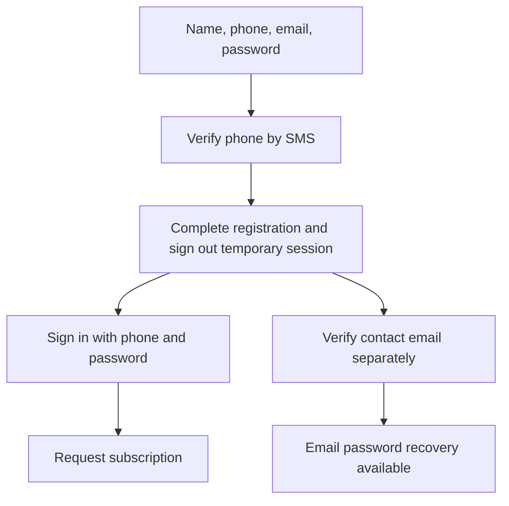

# Authentication and sessions

Commuter entry flow updated: 2026-10-09. Migration 048 is not deployed yet.

## Sign-in methods

- Commuters: phone number and password through `POST /v1/auth/phone/password`.
  Account creation verifies phone possession with `/v1/auth/phone/request`
  and `/v1/auth/phone/verify`, then submits names, contact email and password
  to `/v1/me/phone-registration`. Legacy social, OTP and email sign-in API
  operations remain for existing staging clients but are hidden from the new
  commuter entry screen.
- Drivers: `POST /v1/auth/driver` with driver code and six-digit PIN.
  Ops creates drivers and issues/resets temporary credentials. Temporary PINs
  expire and require a private PIN change before normal driver work.
- Ops: invited Google account plus WebAuthn passkey registration/authentication.
  Current database role and session elevation are enforced on Ops requests.
  Invitations require both their secret link and the matching verified Google
  identity. They never replace the passkey check.

HS256 access tokens are verified for signature, issuer, audience and expiry.
Current session, role and account state are checked in the database.
Refresh tokens rotate; consumed-token reuse revokes sessions. Mobile credentials
use OS secure storage; Ops access tokens are in memory and refresh state is
tab-scoped. There is no fake-provider fallback in the deployed composition.

## Phone verification and account boundaries

mNotify delivers six-digit codes. Signup OTP records possession of that phone
number. A pending signup session may only read its account and complete
registration. Once the full name, email and password are saved, all temporary
sessions are revoked and the rider signs in with phone and password.

A full rider name and an active verified phone record are required for standby.

Signup collects `firstName` and `lastName`, plus optional `otherNames`, before
sending the OTP. The API constructs `displayName` as first, other, last,
separated by spaces. First/last names allow 60 characters each and other names 80,
with a combined display name limited to 200 characters. Unicode names are supported;
controls are rejected. The account response
returns all three components. Existing names are not split by guessing.
Name entry does not itself verify legal identity.
A profile phone field or payment phone is not verification.
Matching numbers never silently merge accounts or transfer subscriptions.
Collision/review states do not authorize taking another account's number.

OTP has bounded lifetime, attempts, resend and shared spend limits. Uncertain
delivery invalidates the challenge instead of pretending a usable code was sent.
See [mNotify operations](../operations/mnotify-phone-sign-in.md).

## Driver and administrator controls

Ops can issue/reset, suspend, reinstate and unlock driver credentials. Resets
revoke sessions. Delivery can be SMS or email, or a private one-time handoff;
do not log credentials. [Onboarding](../driver-onboarding.md) covers recovery.

Passkey reset requires another elevated superadmin. Phone OTP is not an Ops
second factor. The dedicated maintenance identity is non-human and separate
from interactive operators.

Sources: `services/api-next/src/auth/`, `runtime/config.ts`,
`apps/ops/src/auth/`, `apps/trotxi_driver/lib/core/state/session_controller.dart`.
Configuration support does not prove Apple or production provider setup.

## Contact email, recovery and legacy email access

The current commuter app has one public entry method. Signup collects first,
last and optional other names, Ghana mobile number, contact email and password.
It requests an mNotify code, exchanges that code for a limited pending session,
then calls `POST /v1/me/phone-registration`. The API stores the full name and
Argon2id password hash, queues a contact-email verification link, revokes the
pending session and asks the rider to sign in with phone and password. A
restored pending session returns to the completion screen, not Home. No email
proof is needed to sign in or join standby after phone registration.
Migration 048 marks older staging phone-only accounts without a password as
pending so they can verify by SMS and finish signup without losing their rider
record. Existing phone accounts that already have a password keep it.

The contact email starts unverified. Its link opens the public
`/account-access#token=...&purpose=contact` page, which calls
`POST /v1/auth/email/verify`. The rider can resend from Profile. Recovery uses
`POST /v1/auth/email/reset` only after contact verification. Its response is
generic for unknown or unverified addresses. Resetting the password revokes
old sessions and requires a fresh phone/password sign-in. It does not change
phone verification.

### Legacy staging paths

The API still serves email signup/login and Google/Apple commuter operations
for older staging clients while the new build rolls out. The current app does
not show those choices. The legacy email flow is:

1. Signup collects full-name fields and email, then calls
   `POST /v1/auth/email/signup`. No password or usable session exists yet.
2. A verification email opens `/account-access#token=...` on the configured
   Ops web origin. This is a public commuter page, outside the Ops sign-in gate.
   It clears the fragment from browser history and keeps the secret only in
   memory. Opening the email does not consume the link.
3. The user chooses and confirms a password, then the page calls
   `POST /v1/auth/email/complete`. The 30-minute, single-use link proves email
   ownership and enables email login. Return to the app to sign in.
4. Login returns ordinary commuter access/refresh tokens. It does not verify
   phone possession or make the commuter eligible for standby without OTP.

Forgot password calls `POST /v1/auth/email/reset`. Responses are generic for
unknown addresses and addresses without email credentials. Provider send time
is not awaited in that response. Completing reset invalidates all older email
links and sessions, including other devices. It does not automatically log in.
The user receives a password-change notice. Reset requests alone do not change
the password or lock the user out.

**Profile > Security & sign-in > Security & recovery** supports adding an email
to an account first created with Google or phone. This requires a sign-in from
the last 15 minutes when requesting the code, and proof of the new email. The
code keeps its full 30-minute lifetime in that same live session; completion
does not repeat the session-age check. The emailed code is entered in
the initiating app session with a new password. Another account or session
cannot redeem it, and the public signup completion cannot redeem a linking
code. Linking retains the same rider ID, subscriptions and existing sign-in
method. Matching a contact address never merges two accounts. An address
already used by another account is refused. Adding Google to an email-created
account is not implemented; use email sign-in for that account.

The same security screen changes an enabled password using the current
password and recent sign-in. It signs out all sessions. Google-only users
manage their Google password with Google until they explicitly add email
sign-in here. Driver PIN recovery and Ops invitations/passkeys are unchanged.

Passwords allow 15 to 128 characters without composition rules, with a small
local common-password rejection list. They are hashed with Argon2id (19 MiB,
two passes, one lane) and random salts. At most two hashes run concurrently per
API process; excess work returns a retryable busy error. Login is bounded by
shared IP, phone/IP, phone-account and email/IP budgets. Verification/resets send at most once per
minute and five times per account per hour. This is not a compromised-password
database check or multi-factor authentication.

Only token hashes are stored in challenges. Email links are encrypted in the
existing outbox, checked again before delivery, and retried by the existing
email worker. Account erasure scrubs credentials, names and outstanding links.
The existing `erasures` job also clears expired token hashes and releases
unverified email claims after one day; never-activated signup profiles with no
sessions or other identities are scrubbed. Run that job regularly. No new
paid provider or scheduled service is required by this implementation.

### Release and acceptance

- Apply migration 048 and deploy the API and public recovery page before
  distributing the new commuter build. mNotify and Resend configuration must
  be healthy. The web origin must match API CORS.
- Register with full name, phone, email and password. Verify the SMS, then sign
  in with phone and password. The first session must not reach Home before
  registration completes. A reopened pending signup must resume completion.
- Confirm standby does not ask for a second OTP after signup. Verify the
  contact-email link separately, then test email-based password recovery.
- Reset from a second device. The old password and both old sessions must fail;
  the new password must work. Expired and already-used links must be refused.
- Legacy email linking and social accounts remain during staging transition;
  they are not offered on the new commuter entry screen.
- Test browser mail links on Android and iOS. Browser completion and returning
  to app sign-in are supported; native universal-link opening is not required.
- Real-provider delivery and physical-device acceptance are separate from
  local automated tests. Never paste passwords or link tokens into tickets.

## Flow and ownership

The commuter initiates login and stores tokens through the shared client.
The API verifies credentials and owns sessions/phone verification. mNotify
delivers the challenge but cannot itself grant access. Ops has a separate
Google-plus-passkey flow; driver access uses code/PIN, not commuter OTP.

| Situation                          | Client behavior                                       | Server boundary                                                          |
| ---------------------------------- | ----------------------------------------------------- | ------------------------------------------------------------------------ |
| Pending phone registration         | Resume registration; do not open Home                 | Only account read and registration completion are allowed                |
| Phone OTP already succeeded        | Do not ask for another OTP just to join               | Verified record still belongs to that account                            |
| Expired/wrong/replayed code        | Show failure; request a fresh challenge when eligible | No session/verification granted                                          |
| Send refused or unconfirmed        | Show delivery failure and retry guidance              | Do not treat challenge as verified                                       |
| 429                                | Honor Retry-After; preserve user input                | Shared and purpose-specific budgets apply                                |
| Account number collision           | Show the explicit review/conflict state               | No silent account/subscription merge                                     |
| Refresh request loses its response | Use shared-session recovery behavior                  | Refresh tokens are single-use; unsafe parallel reuse can revoke sessions |

Temporary driver PINs must complete private-PIN setup before trip work.
Never implement a generic “retry every 401” wrapper around mutations.

Developer entry points:
[OTP](../../services/api-next/src/auth/phone-otp.ts),
[auth service](../../services/api-next/src/auth/service.ts),
[session client](../../apps/trotxi_client/lib/commuter_session_client.dart).
Tests: [auth](../../services/api-next/tests/auth.pg.test.ts) and
[account](../../services/api-next/tests/account.pg.test.ts).
Requests: [worked auth examples](../api/worked-examples.md#2-establish-commuter-eligibility).

## Invite only Ops access

The Ops login uses `POST /v1/auth/ops/google`, not the commuter registration
endpoint. An uninvited Google identity receives `ops_access_required` without
creating an account. Existing administrators continue to sign in normally.
`isSuperadmin` is an additional capability on an admin, checked in the database
on each access-management request; it is not trusted from a token or UI flag.

Only an elevated superadmin can list the team, issue/resend/cancel invitations,
change administrator access or reset another operator's passkeys. Every change
(invite, resend, cancel, delete, promote, demote, passkey reset) also needs a
passkey check from the last five minutes, not just the eight-hour session
elevation; otherwise the request returns `passkey_required` and the console asks
for the passkey before the change is repeated. A session taken over within the
elevation window therefore cannot invite an address its holder controls. Ordinary
admins retain dispatch and support work. The old role endpoint cannot grant
admin access or downgrade an administrator to a commuter or driver. It requires
superadmin authorization for the remaining commuter/driver role changes.

An invitation lasts 48 hours. Email delivery uses the encrypted transactional
outbox, immediate delivery attempt and existing retry worker. Provider acceptance
does not prove inbox delivery. Resending rotates the secret and makes the old
link unusable. The database stores only its hash; the encrypted email contains
the link. The UI removes the URL fragment before sign-in and keeps the secret
only in memory. Reloading before sign-in may require reopening the email.

Google verification must return the invited email. Matching a profile email
alone never grants access or merges identities. Operators use a Google account
and address that are not already a Trotxi account: an invitation to an address
that belongs to any account is refused, and a Google identity that already has a
rider or driver account cannot claim one (`operator_account_conflict`). Claiming
creates a new account with only passkey-setup access. Completing a verified passkey
ceremony before expiry
activates Ops access and consumes the invitation. Cancelling unclaimed invitations
invalidates the link. Cancelling claimed setup deletes the account created for that
invitation, after an explicit warning; it never holds a rider profile. Expired setup
cannot activate.

Invitations that were never claimed can be resent, including after expiry.
Cancel an expired claimed invitation before issuing a replacement. Expired
invitations remain in Team & access until a superadmin resolves them. Acceptance
and cancellation scrub the duplicate invite name/email and secret. Account
erasure also scrubs matching invitations; audit IDs remain, without link secrets.

Access changes and passkey resets appear in Audit log. **Delete account** in Team
closes the entire account through the existing erasure flow, rather than changing
its role to commuter. It revokes sessions and passkeys, scrubs personal details
and identity links, and closes membership state under the existing erasure policy.
Required financial and audit records remain; external cleanup uses the durable
erasure queue. The recovery fence and independent deletion journal apply when
configured. The team command receipt, local erasure and attributed event commit
together, so retrying the same command does not delete twice.

**Make administrator** only removes superadmin capability and keeps ordinary Ops
access. Self access changes are refused. The last superadmin cannot be erased;
that refusal happens before writing a durable deletion intent.

Source: [team service](../../services/api-next/src/auth/ops-team.ts).
First-owner setup: [deployment](../DEPLOY.md#first-superadmin-setup).
