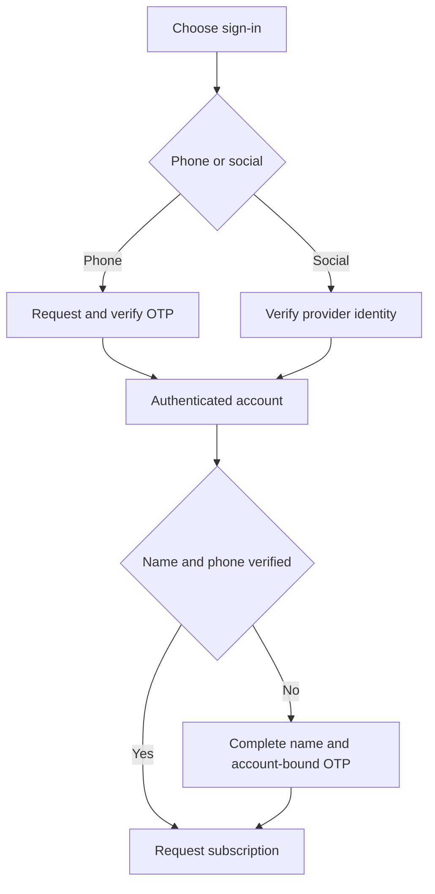

# Authentication and sessions

Source audit: 2026-10-03.

## Sign-in methods

- Commuters: `POST /v1/auth/google`, optional configured Apple, or
  `/v1/auth/phone/request` then `/v1/auth/phone/verify`.
- Drivers: `POST /v1/auth/driver` with driver code and six-digit PIN.
  Ops creates drivers and issues/resets temporary credentials. Temporary PINs
  expire and require a private PIN change before normal driver work.
- Ops: approved Google account plus WebAuthn passkey registration/authentication.
  Current database role and session elevation are enforced on Ops requests.
  A role-grant email is notification, not an access credential.

HS256 access tokens are verified for signature, issuer, audience and expiry.
Current session, role and account state are checked in the database.
Refresh tokens rotate; consumed-token reuse revokes sessions. Mobile credentials
use OS secure storage; Ops access tokens are in memory and refresh state is
tab-scoped. There is no fake-provider fallback in the deployed composition.

## Phone verification and account boundaries

mNotify delivers six-digit codes. A successful phone sign-in records verified
phone possession for that phone account. Google/Apple users can sign in without
a phone; the authenticated `/v1/me/phone-verification/start` and `confirm`
flow verifies their number before standby enrollment/acceptance.

A basic rider name and an active verified phone record are required for standby.
A profile phone field, payment phone or social login is not verification.
Matching numbers never silently merge accounts or transfer subscriptions.
Collision/review states do not authorize taking another account's number.

OTP has bounded lifetime, attempts, resend and shared spend limits. Uncertain
delivery invalidates the challenge instead of pretending a usable code was sent.
See [mNotify operations](../operations/mnotify-phone-sign-in.md).

## Driver and administrator controls

Ops can issue/reset, suspend, reinstate and unlock driver credentials. Resets
revoke sessions. Delivery can be SMS or email, or a private one-time handoff;
do not log credentials. [Onboarding](../driver-onboarding.md) covers recovery.

Passkey reset requires another elevated operator. Phone OTP is not an Ops
second factor. The dedicated maintenance identity is non-human and separate
from interactive operators.

Sources: `services/api-next/src/auth/`, `runtime/config.ts`,
`apps/ops/src/auth/`, `apps/trotxi_driver/lib/core/state/session_controller.dart`.
Configuration support does not prove Apple or production provider setup.

## Flow and ownership

The commuter initiates login and stores tokens through the shared client.
The API verifies credentials and owns sessions/phone verification. mNotify
delivers the challenge but cannot itself grant access. Ops has a separate
Google-plus-passkey flow; driver access uses code/PIN, not commuter OTP.

| Situation                          | Client behavior                                                 | Server boundary                                                          |
| ---------------------------------- | --------------------------------------------------------------- | ------------------------------------------------------------------------ |
| Google sign-in, phone unverified   | Allow ordinary account access; verify before requesting service | Standby rejects missing verification                                     |
| Phone OTP already succeeded        | Do not ask for another OTP just to join                         | Verified record still belongs to that account                            |
| Expired/wrong/replayed code        | Show failure; request a fresh challenge when eligible           | No session/verification granted                                          |
| Send refused or unconfirmed        | Show delivery failure and retry guidance                        | Do not treat challenge as verified                                       |
| 429                                | Honor Retry-After; preserve user input                          | Shared and purpose-specific budgets apply                                |
| Account number collision           | Show the explicit review/conflict state                         | No silent account/subscription merge                                     |
| Refresh request loses its response | Use shared-session recovery behavior                            | Refresh tokens are single-use; unsafe parallel reuse can revoke sessions |

Temporary driver PINs must complete private-PIN setup before trip work.
Never implement a generic “retry every 401” wrapper around mutations.

Developer entry points:
[OTP](../../services/api-next/src/auth/phone-otp.ts),
[auth service](../../services/api-next/src/auth/service.ts),
[session client](../../apps/trotxi_client/lib/commuter_session_client.dart).
Tests: [auth](../../services/api-next/tests/auth.pg.test.ts) and
[account](../../services/api-next/tests/account.pg.test.ts).
Requests: [worked auth examples](../api/worked-examples.md#2-establish-commuter-eligibility).
