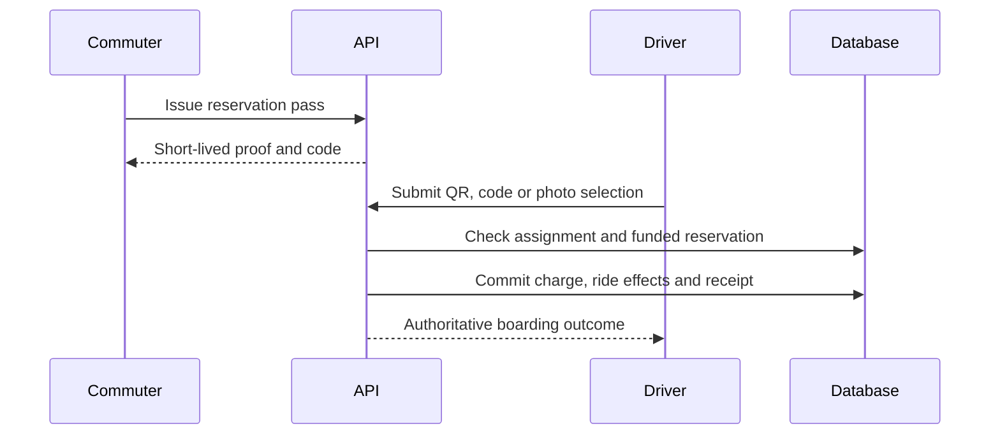

# Boarding verification

Source audit: 2026-10-03.

The assigned driver boards a reservation using a QR proof, boarding code or
photo-manifest selection. All methods converge on one transactional settlement.

## API

- Rider: `POST /v1/me/reservations/{id}/pass`.
- Driver manifest: `GET /v1/driver/trips/{id}/manifest`.
- Boarding: `POST /v1/driver/trips/{id}/boardings`.
- No-show: `POST /v1/driver/trips/{id}/reservations/{reservationId}/no-show`.
- Ops manifest: `GET /v1/ops/trips/{id}/manifest`.

Passes are reservation-bound and short-lived. The server validates proofs,
ownership, current assignment, trip and funded-reservation state. Code attempts
have a durable budget. A photo URL is resolved from private account storage,
never trusted from a QR payload.

A boarding/no-show charge is unique to the reservation. The reservation,
charge, ledger effects, receipt and required events commit together or roll
back. A retry does not deduct another ride. Optional telemetry after commit
may fail without undoing settlement; required accounting does not fail open.

A boarding code is an alternative to the camera, not offline authorization.
The driver still needs an API confirmation. No local offline boarding queue is
implemented. Declined, cancelled or otherwise ineligible seats cannot be boarded
simply because an old QR or screenshot exists.

Sources: `services/api-next/src/boarding/{service,proofs}.ts`,
`tests/boarding.pg.test.ts`, driver Scan/Manifest screens.

## Online settlement

Only the driver assigned to the active trip may perform its boarding work.
The commuter displays the proof; they do not self-board by posting a scan.
Photo selection is a manifest workflow, not facial-recognition KYC.

On a lost response, retry the same action with its idempotency key. The unique
reservation charge prevents a second debit. Do not show success just because
a camera decoded the QR. Wrong trip, stale proof, ineligible reservation or
lost assignment must remain refusals even if an old image/code looks valid.

A later correction must use the supported server behavior; do not directly
edit ride balances. A no-show and boarding must never become two charges.

Code: [settlement](../../services/api-next/src/boarding/service.ts),
[proofs](../../services/api-next/src/boarding/proofs.ts).
Tests: [database cases](../../services/api-next/tests/boarding.pg.test.ts).
Calls: [pass and code boarding](../api/worked-examples.md#4-reserve-and-operate-the-trip).
