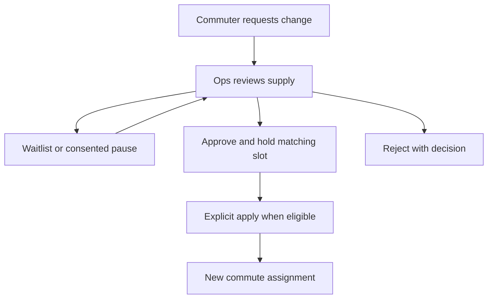

# Commute-change requests

Source audit: 2026-10-03.

An existing member requests a transfer; Ops reviews recurring capacity.
This is separate from the new subscription standby/offer queue. Submitting
preferences does not change the paid commute.

The commuter Profile flow submits a versioned commute selection, requested
date and pause consent, then shows durable status and decisions. Ops Support
provides the request queue and decision history. Routes & stops → Commute slots
provides the capacity records used for approved transfers.

## API

- Own list/create: `/v1/me/commute-requests`.
- Withdraw: `POST /v1/me/commute-requests/{id}/withdraw`.
- Ops list: `GET /v1/ops/commute-requests`.
- Decision/history: `/v1/ops/commute-requests/{id}/decisions` and `events`.
- Transfer slots: `/v1/ops/commute-slots` and `/{id}/retire`.

Use the exact schema and cursor pagination in the generated contract, not old
route-stop IDs or offset examples. Decisions include waitlist, consented pause,
resume, approval, explicit apply, rejection and cancellation. Approval holds
a matching slot; application on/after the effective date is a separate action.

Current trip and unsettled financial state can block a change. Pauses do not
clear disputes/restrictions. Resume extends coverage by elapsed paused time,
not by creating extra rides or money. Different fare requirements go to review
rather than silently repricing paid service.

Pending or prepaid renewal blocks changes that would conflict with frozen
coverage dates. Resolve the renewal first. Personal vacation pauses are a
separate bounded flow described in [rider services](../backend-rider-services.md).

Erasure closes requests, removes free-text personal data and releases relevant
capacity while retaining restricted audit attribution.

Sources: `services/api-next/src/membership/service.ts`,
`apps/ops/src/screens/Support.tsx`, commuter commute-preference screens.

## Review is separate from application

This is a transfer of an existing member's commute, not the subscription-offer
queue. The commuter can inspect/withdraw eligible requests. Ops makes and records
the decision, then explicitly applies an approved change at its effective date.

Do not switch the client to the requested route merely because the request was
submitted or approved. Re-read current membership/commute after application.
Paused coverage, unsettled travel, capacity, fare differences and renewal locks
can prevent application; show the conflict rather than editing the assignment
directly.

Code: [membership service](../../services/api-next/src/membership/service.ts),
[Ops Support](../../apps/ops/src/screens/Support.tsx).
Tests: [membership decisions](../../services/api-next/tests/membership.pg.test.ts).
