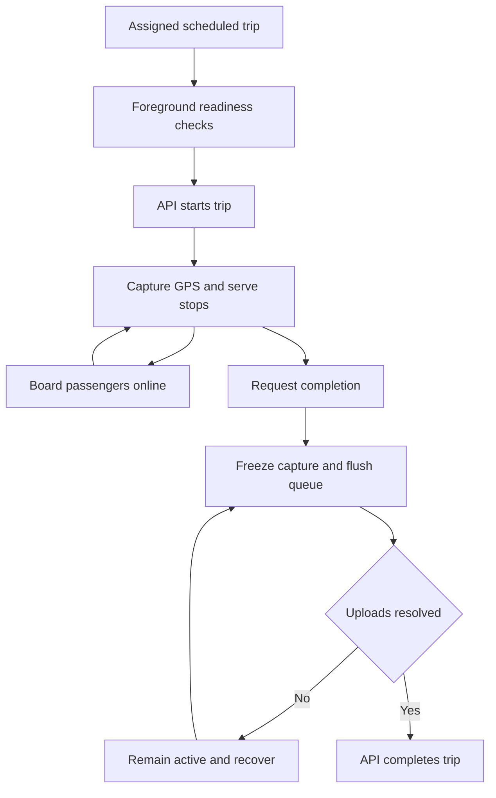

# Driver operations

Source audit: 2026-10-03.

Ops provisions the driver and issues a temporary code/PIN through private
handoff, email or SMS. First sign-in requires replacing a temporary PIN.
Profile supports photo, PIN change, support/privacy and device readiness.

Presentation uses the bundled Poppins typography and shared driver colour
tokens. Home and Profile share the account photo, with an initials fallback;
session changes must clear the previous account's image. Reuse the theme
rather than adding screen-specific fonts or colours.

The driver app lists assigned runs, checks location readiness before starting,
records stop arrivals, boards through QR/code/photo, shows manifest/summary and
completes the trip. Camera access is optional when using code/photo paths.
The API rechecks assignment, account/session state and lifecycle eligibility.

GPS belongs to the active signed-in trip, not the visible tab. Capture starts
in the foreground and can continue while backgrounded or locked. Android uses
a visible location foreground service; iOS uses background location support.
This is not a promise of collection after force-quit or reboot.

A bounded secure-storage queue retains original fix IDs/times until matching
receipts. Completion freezes capture and attempts a bounded flush; unresolved
queued data is surfaced instead of falsely claiming completion. The local map
uses device GPS and is not evidence of server receipt.

Drivers submit incident reports and route/leave requests. Ops can decide them
in Support. A work-request approval records the decision; it does not itself
change a trip assignment. Polling refreshes the roster; optional assignment
push requires provider setup and push-worker invocation.

API groups: `/v1/driver/trips`, `/v1/driver/incidents`,
`/v1/driver/requests`, `/v1/driver/available-routes`.

Sources: `apps/trotxi_driver/lib/data/position_publisher.dart`,
`position_queue.dart`, `services/api-next/src/transport/operations.ts`.
See [reliability](../driver-reliability.md),
[onboarding](../driver-onboarding.md) and
[device/privacy checks](../driver-privacy-and-guidance.md).

## Run lifecycle

Ops owns assignment and fleet. The driver owns the active-run interaction;
the publisher owns capture/queue state independently of the selected tab.
The API remains authoritative for lifecycle and assignment.

An Ops driver-request decision is not a lifecycle transition. Approving leave
or a route request does not reassign a running trip.

If the driver loses assignment/access, stop publishing and refresh the roster.
If a delivery queue cannot drain, retain the explicit unresolved state rather
than calling completion behind the UI. A map dot alone cannot establish that
Ops received the position.

Code: [publisher](../../apps/trotxi_driver/lib/data/position_publisher.dart),
[queue](../../apps/trotxi_driver/lib/data/position_queue.dart),
[transport](../../services/api-next/src/transport/service.ts).
Tests: [GPS](../../services/api-next/tests/gps.pg.test.ts),
[trip commands](../../services/api-next/tests/transport-commands.pg.test.ts).
Calls: [start, position and completion](../api/worked-examples.md#4-reserve-and-operate-the-trip).
