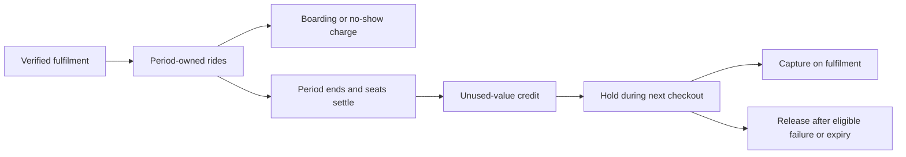

# Ride entitlements and Ride Credits

Source audit: 2026-10-03.

Ride allowances and monetary credits are different units:

- Ride entries allocate/retire period-owned ride counts.
- Reservation charges attribute boarding/no-show consumption to the funded period.
- Credit entries record integer-pesewa renewal discounts.
- Credit holds reserve available discount during checkout; a hold is not money
  already collected and must be captured or released.

For offered subscriptions, balances and limits are directional. Booking must
match the offered journey, travel weekday and coverage period. Boarding and
no-show share one charge identity, so retries or a later boarding correction
cannot charge twice.

Period close waits for unsettled seats, converts each direction's unused
allowance at its disclosed frozen credit value, retires the remaining rides
and closes only that period. Already sold terms do not change with new fares.
Historical non-offer periods retain their original accounting rules.

Current coverage excludes future periods. Upcoming coverage is returned
separately by `GET /v1/me/membership`. Renewal can be prepaid, but unconverted
current rides cannot fund it. Credit is neither a transferable cash wallet nor
a withdrawal balance.

Read history through `GET /v1/me/ride-entries` and
`GET /v1/me/credit-entries`. Period close is
`POST /v1/ops/maintenance/period-close`, also part of payment maintenance.

Sources: `services/api-next/src/payments/foundation.ts`,
`services/api-next/src/membership/service.ts`, migrations 011, 013 and 042.
See [payments](payments-and-wallet.md) for refunds, pauses and renewals.

## Accounting flow

The backend owns every balance transition. The client renders balances; it does
not compute authoritative credit from the number of unboarded trips.

Example: an offered period grants 20 rides in each direction and discloses
500 pesewas per unused ride. If two outbound and three return rides remain at
eligible closure, the conversion is 2,500 pesewas. It is not a cash refund.
Pending/held credit is excluded from the amount available for another checkout.

If closure is blocked by unsettled seats, resolve those seats first. Do not
force conversion or project the amount into a prepaid renewal. Refund/dispute
handling must preserve the purchased-period attribution and immutable evidence.

Code: [financial foundation](../../services/api-next/src/payments/foundation.ts).
Tests: [pricing/renewal](../../services/api-next/tests/pricing.pg.test.ts) and
[boarding attribution](../../services/api-next/tests/boarding.pg.test.ts).
