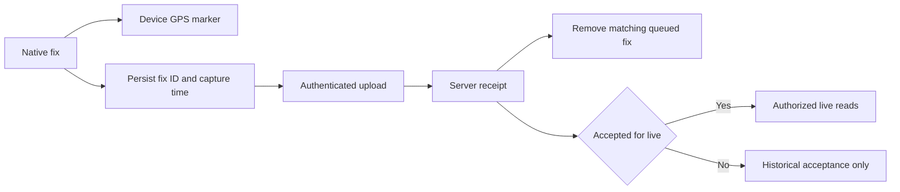

# Live positions, ETA and retention

Source audit: 2026-10-03.

Assigned drivers upload through `POST /v1/driver/trips/{id}/positions`.
Authorized readers use `GET /v1/trips/{id}/live`; Ops also receives positions
in its aggregate overview. A bearer token alone is not unrestricted access to
every rider's trip.

Fixes carry stable client IDs and original capture times. The API checks
assignment, active collection session, coordinates, age and clock skew, and
returns a receipt. Delayed fixes do not replace a newer live position just
because they arrived later. Captures older than 24 hours are refused; collection
sessions are bounded to 24 hours. Live freshness is distinct from accepted
historical storage.

The driver has a bounded durable GPS queue, background/locked-screen collection
and receipt-based delivery status. Its local map uses the device fix, not a
server round trip. Commuter tracking and Ops poll scoped API state.
See [driver reliability](../driver-reliability.md).

Configured version-owned geometry supplies the path. Learning stores trace-based
geometry/speed evidence; ETA uses route progress and segment information, with
explicit freshness/quality limits. No live traffic vendor, automatic Valhalla
map matching or synthetic moving vehicle is part of this implementation.

Raw trace retention and explicit evidence holds are implemented, including
bounded draining and overdue reporting. Storage does not expire merely because
a policy exists: the retention worker must run. Hold creation and removal are
Ops-audited commands. See [driver privacy](../driver-privacy-and-guidance.md).

Sources: `services/api-next/src/transport/{gps,trips,operations}.ts`,
`runtime/maintenance.ts`. MQTT/Go/WebSocket delivery remains unimplemented.

## Capture is not delivery

The local marker can move even while the network is unavailable. Conversely,
acceptance of a delayed fix does not replace the latest position. Readers must
honor age and availability, not infer freshness from the time they fetched it.

| Failure                            | Required behavior                                              |
| ---------------------------------- | -------------------------------------------------------------- |
| Network/temporary error            | Keep the original fix and retry under bounded queue rules      |
| 429                                | Honor cooldown; do not generate a new identity for the old fix |
| Same ID, changed payload           | Surface the conflict; do not overwrite accepted evidence       |
| Authorization/session/trip refusal | Stop inappropriate publishing and refresh state                |
| Queue full/storage failure         | Show degraded delivery instead of dropping new facts silently  |
| Expired queued fix                 | Record the expiry outcome; never relabel it as fresh           |

Code: [GPS ingestion](../../services/api-next/src/transport/gps.ts),
[publisher](../../apps/trotxi_driver/lib/data/position_publisher.dart).
Tests: [GPS receipt/retention cases](../../services/api-next/tests/gps.pg.test.ts).
Calls: [GPS upload](../api/worked-examples.md#upload-one-captured-gps-fix).
