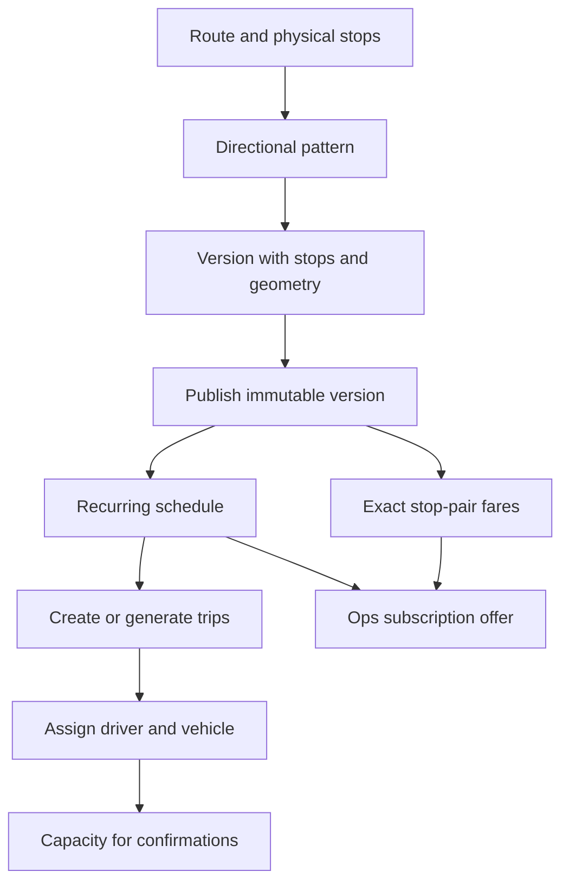

# Routes, schedules and fleet

Source audit: 2026-10-03.

## Model

A route is a corridor. A reusable physical stop is distinct from an ordered
stop occurrence on a directional pattern version. The same stop can occur
twice on a loop. Patterns have explicit outbound/return direction.

Published versions freeze stop snapshots and configured geometry. Corrections
create another revision, not an edit to operated history. Service schedules
carry weekdays, local departure, effective dates and explicit morning/evening
window. Window and direction are independent.

Trips retain stable departure, service date and run identity across rescheduling
and cancellation. Launch supports run 1. A delay past midnight does not rewrite
the service date. Driver/vehicle assignment is an explicit Ops command.

## Ops setup

1. Routes & stops → Routes → New route.
2. Stops → New stop: name and valid coordinates.
3. Patterns & versions: create each direction, add ordered stop occurrences,
   trace configured geometry, create and publish the revision.
4. Schedules: choose published version, service window, departure, weekdays
   and effective dates.
5. Fares: publish exact ordered pickup/drop-off prices for offers.
6. Trips: create/generate eligible runs, then assign driver and vehicle.

The map editor is manual drawing, not automatic road routing or map matching.
Publishing/archiving refuses changes that would invalidate existing trips.
Ops must resolve affected work instead of bypassing guards.

Public catalog operations use `/v1/routes`, route schedules, pattern/version
and geometry resources. Ops mutation routes use `/v1/ops`. Driver lifecycle
uses `/v1/driver/trips/{id}` start, arrivals and complete commands.

Sources: `services/api-next/src/transport/`, migrations 001 through 006,
`apps/ops/src/screens/{Network,Trips,Fleet}.tsx`.
See [Ops workflows](ops-console.md) and [live positions](live-positions.md).

## Setup dependencies

Ops owns this setup. The commuter only selects published service; the driver
does not define the route, price or capacity from the app.

| Object          | Important distinction                                                       |
| --------------- | --------------------------------------------------------------------------- |
| Physical stop   | A reusable place with coordinates                                           |
| Stop occurrence | An ordered visit inside one version; use this ID for fares and commute legs |
| Pattern         | Explicit outbound or return direction                                       |
| Version         | Immutable published stop/geometry snapshot                                  |
| Schedule        | Recurring departure, weekdays and date window                               |
| Trip            | One service date/run; assignment and lifecycle are separate                 |
| Fare            | Effective exact pickup/drop-off pair, not automatically summed segments     |

Worked setup: [API calls](../api/worked-examples.md#1-ops-prepares-service).
Create both directions and publish fares for both before testing an offer.
Publishing a version does not generate trips. A route visible in catalog does
not imply an assigned vehicle or available seat.

For a stale edit, fetch the current edit token and reconcile. For a schedule,
geometry or publication conflict, fix the setup; do not retry blindly or
overwrite historical versions. For missing departures, check generation,
service date, weekday, effective dates and assignment independently.

Developer entry points: [catalog](../../services/api-next/src/transport/catalog.ts),
[trip commands](../../services/api-next/src/transport/service.ts),
[Ops Network](../../apps/ops/src/screens/Network.tsx) and
[Trips](../../apps/ops/src/screens/Trips.tsx).
Tests: [catalog/trips](../../services/api-next/tests/transport.pg.test.ts),
[commands](../../services/api-next/tests/transport-commands.pg.test.ts).
