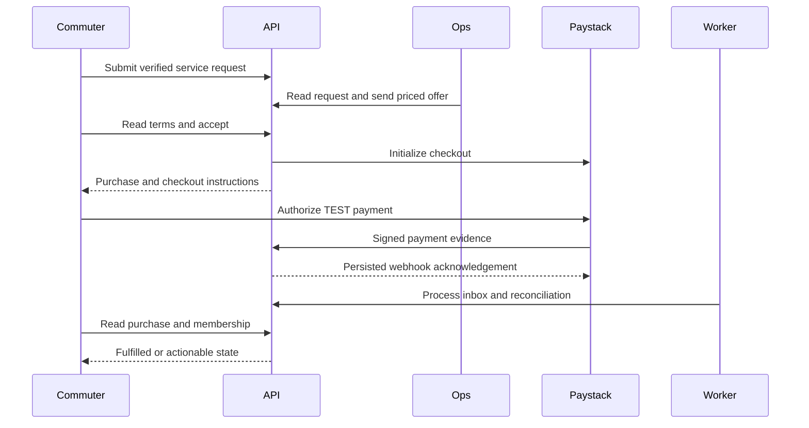

# Subscription offers, payments and renewal

Source audit: 2026-10-03. New purchases require an Ops offer. There is no
public fixed-price checkout, cash top-up wallet or automatic recurring debit.

## Request to payment

1. A signed-in commuter completes their name and verifies a Ghana phone.
2. They request a route, outbound and return journeys, monthly/annual preference
   and travel weekdays through `POST /v1/me/standby`.
3. Ops reviews the queue and sends an offer with coverage dates, package price,
   payment deadline and unused-ride credit for both directions.
4. The app displays the terms. Acceptance creates one purchase and opens
   customer-authorized Paystack checkout, optionally applying available credit.
5. Verified provider evidence fulfils the purchase. A return URL or checkout
   screen is not proof of payment. The app reads the purchase to recover status.

`POST /v1/me/purchases` cannot bypass the offer requirement. An offer does not
reserve fleet capacity; Ops must verify supply and reservations still enforce
capacity. Standby is the subscription request queue, not a single-seat market.

## Pricing and dates

Ops publishes an effective-dated fare for each ordered stop-occurrence pair on
a published route version. B-to-C and C-to-D may differ; B-to-D needs its own
fare, not their sum. Return journeys have separate prices.

The offer freezes route/version, stops, schedules, applicable weekdays, fares,
directional allowances, package price and credit values. Ride counts come from
actual coverage dates intersected with requested and scheduled weekdays, not a
fixed 44. Coverage starts at midnight Ghana time and excludes the end date.
Each direction must have service; one-way offers and holiday exclusions are
not implemented. Coverage lasts at most 366 days.

Ops chooses the package total. Each unused-ride credit is no greater than its
journey fare; all potential credits together cannot exceed the package price.
Money is integer pesewas in storage and API `amountMinor`; UI renders GHS.
There is no fixed 264/2640 product price. Historical plan-pricing controls remain
for compatibility, not the price source for newly offered packages.

## Renewal

One future paid period may coexist with current coverage without overlap. A
new offer can start exactly at the current period's midnight end. Legacy
mid-day boundaries require a later date. The wallet separates upcoming coverage
from current spendable rides.

Reservations and day-ahead asks select the paid period covering departure.
A rider can confirm the first renewal trip before midnight without spending
current-period rides. Old-period settlement is not required to switch coverage.

Only already-created available Ride Credit can reduce early renewal payment.
Unused current rides are not projected into credit. Pending/paid renewals block
pauses and commute changes that could extend the preceding period into them.
This applies to Ops too; resolve/refund the upcoming renewal before changing dates.

## Settlement and recovery

The API verifies Paystack signatures and persists deduplicated provider events.
Workers process evidence, verify unresolved attempts and close eligible periods.
Collections must match the expected purchase, amount, currency and environment.
Idempotency and transactional fulfilment prevent duplicate allocations.

An expired offer may leave an open Paystack page. Late or conflicting collections
go to Ops review rather than activating invalid coverage. Local expiry releases
holds but does not prove that the provider collected nothing. Check the original
collection before advising another payment.

Ops can initiate a TEST refund and inspect accepted/unknown intent; a submitted
refund is not settled cash. Processed refund and dispute evidence drive the
financial effects. Refunds of upcoming coverage affect that purchased period,
not unrelated current rides. Partial/consumed-value cases require review.

The checked-in GitHub workflow runs payment recovery and email retry every
15 minutes on main, subject to environment configuration. It does not run
all rider-service or retention jobs. See [deployment](../DEPLOY.md).

## Limits and verification

Stored mandates, automatic renewal, card-payment rollout, operator payouts,
corporate invoicing and automatic standby-seat cascades remain separate work.
Staging uses Paystack TEST only.

Sources: `membership/standby.ts`, `membership/offer-terms.ts`,
`payments/{pricing,foundation,purchases,recovery}.ts` under
`services/api-next/src`; migrations 041/042; `tests/pricing.pg.test.ts`.
Use the [staging runbook](../runbooks/rider-services-staging.md) for acceptance.

## Who does what

This is the successful path. Webhook timing can differ, and duplicate callbacks
are expected. The worker's verified transactional result, not message order or
the return URL, establishes coverage.

Ops selects terms; the commuter explicitly accepts/pays; the API freezes and
enforces them; Paystack reports collection; workers process evidence; Ops
resolves review/refund cases. Frontend code must not allocate rides itself.

## State and recovery

| Resource/state                             | Meaning                                   | Correct next step                                                |
| ------------------------------------------ | ----------------------------------------- | ---------------------------------------------------------------- |
| Application `submitted`                    | Request exists, no payable offer yet      | Ops checks supply and prepares terms                             |
| Application `offered`                      | Terms can be reviewed                     | Commuter accepts before expiry or withdraws                      |
| Offer `accepting`                          | One acceptance key owns checkout creation | Retry the same logical request/key after an uncertain response   |
| `checkout_open`                            | Purchase is linked                        | Read that purchase; do not create another direct checkout        |
| Purchase `awaiting_payment` / `processing` | No confirmed fulfilment yet               | Recover the same purchase and check processing                   |
| Purchase `fulfilled`                       | Its service value was granted             | Read membership; future coverage still shows upcoming            |
| Purchase `review_required`                 | Automated fulfilment cannot safely finish | Ops reviews evidence; do not instruct another payment            |
| Purchase `failed` / `cancelled`            | Purchase does not provide new coverage    | Inspect failure/collection evidence before replacement or refund |

Application completion is not proof of payment: it can also follow a failed
purchase. Always read the purchase state and current membership.

| Refusal                           | Resolution                                                            |
| --------------------------------- | --------------------------------------------------------------------- |
| `phone_verification_required`     | Verify the current account's phone                                    |
| `standby_profile_incomplete`      | Complete rider name                                                   |
| `invalid_offer_expiry`            | Use an allowed future deadline no later than coverage start           |
| `coverage_active`                 | Set non-overlapping coverage dates                                    |
| `offer_expired`                   | Review any existing collection before requesting a fresh offer        |
| `idempotency_conflict`            | Do not change payload beneath an existing command key                 |
| Uncertain provider/network result | Keep original identity and reconcile, never assume “nothing happened” |

## Worked price and renewal

For coverage from 5 October through the exclusive 2 November 2026 boundary,
Monday-Friday service gives 20 rides per direction. Example fares are GHS 10
each, package price GHS 400 and unused credit GHS 5 per ride. API values are
1000, 40000 and 500 pesewas. Total potential unused credit is GHS 200.
These are illustrative terms, not a product default.

A renewal starting 2 November can be paid before that date. The evening before,
confirmation of a covered departure uses the renewal period. The wallet still
shows it as upcoming until midnight. Closing the old period converts only its
unused value; it must not consume or close the renewal.

Requests: [offer/payment examples](../api/worked-examples.md#3-request-offer-and-pay).
Code: [standby](../../services/api-next/src/membership/standby.ts),
[offer terms](../../services/api-next/src/membership/offer-terms.ts),
[purchases](../../services/api-next/src/payments/purchases.ts),
[foundation](../../services/api-next/src/payments/foundation.ts),
[recovery](../../services/api-next/src/payments/recovery.ts).
UI: [Ops offers](../../apps/ops/src/screens/Standby.tsx),
[commuter offers](../../apps/trotxi_commuter/lib/Features/Home/widgets/Tabs/standby_page.dart).
Tests: [pricing and prepaid renewals](../../services/api-next/tests/pricing.pg.test.ts).
