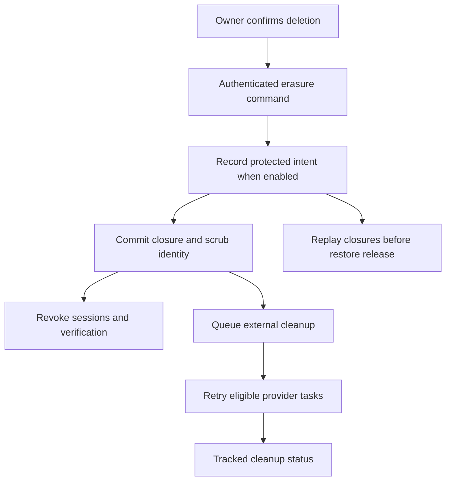

# Profile, avatars and account erasure

Source audit: 2026-10-03.

## Account and photo API

- `GET /v1/me`: own profile and permitted account state.
- `PATCH /v1/me`: reviewed profile fields.
- `PUT /v1/me/avatar`: bounded JPEG, PNG or WebP multipart upload.
- `GET /v1/me/avatar`: short-lived signed private-object URL.
- `DELETE /v1/me/avatar`: detach photo and queue physical cleanup.
- `DELETE /v1/me`: account closure and personal-data erasure workflow.

Upload checks MIME and file bytes with a default 2 MiB bound. The current
backend does not promise the retired sharp-based 256px re-encoding pipeline.
Do not document server EXIF stripping without implementing it. Missing object
storage refuses the feature, not an in-memory production substitute.

Replaced/deleted photos have durable cleanup intents. Retrying an old removal
cannot delete a newer avatar. Existing signed URLs may work until expiry or
physical deletion.

## Closure is more than hiding a user

Account closure revokes sessions, invalidates phone challenges/verification,
scrubs linked personal data and stops eligible future work. Financial/audit
records retain restricted attribution instead of being cascaded away.
External avatar removal and Apple grant revocation have retryable cleanup tasks.

Ops can inspect erasure progress; it cannot certify deletion from external
provider records or every historical backup. Retention, independent closure
journal and restore replay are separate controls. A restore must be fenced,
replay post-snapshot closures and verify writer generation before release.

Authoritative scope:
[data map](../design/account-erasure-data-map.md),
[retention policy](../design/account-erasure-retention-policy.md),
[recovery](../design/account-erasure-recovery.md).
Sources: `services/api-next/src/account/`, migrations and account PG tests.

## Deletion boundary

The app must explain the action and ask for confirmation before sending it.
After successful local closure, clear local account state and return to sign-in.
If the response is lost, recover using the supported idempotency/session outcome;
do not interpret a now-revoked session as proof that deletion failed.

Ops displays local closure and tracked task status. It cannot certify all
provider copies, backups or retained financial records as erased. Keep those
boundaries visible in support replies and UI copy.

An avatar upload is a separate operation. It must not change account ownership.
Ignore stale photo reads after a newer upload or session change. Physical cleanup
of the replaced object can complete later without deleting the new photo.

Code: [account lifecycle](../../services/api-next/src/account/service.ts),
[recovery](../../services/api-next/src/account/erasure-recovery.ts).
Tests: [account](../../services/api-next/tests/account.pg.test.ts),
[recovery](../../services/api-next/tests/account-recovery.pg.test.ts).
Use the linked retention/data-map runbooks before changing stored personal data.
