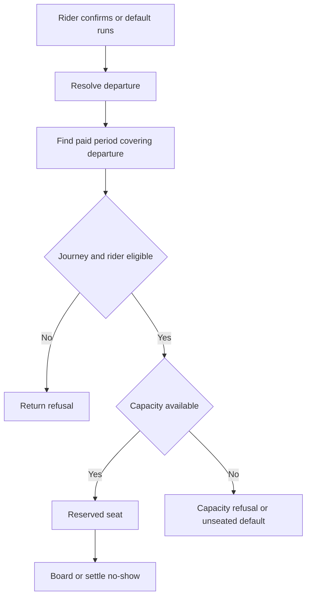

# Ride confirmation and capacity

Source audit: 2026-10-08.

A reservation belongs to a rider, service date, direction, trip and paid period.
Direction is explicitly `outbound` or `return`; it is not inferred from
morning/evening or the hour. Pickup/drop-off are version-owned stop occurrences.

## Operations

- `POST /v1/me/reservation-decisions`: confirm or decline.
- `GET /v1/me/reservations` and `/{id}`: own reservation state.
- `POST /v1/ops/maintenance/ask-dispatch`: create eligible prompts.
- `POST /v1/ops/maintenance/reservation-defaults`: settle unanswered requests.
- `POST /v1/ops/maintenance/no-shows`: settle eligible unboarded seats.

Confirmation checks paid coverage for the departure, commute selection,
restrictions/pauses, offered weekdays/allowance and assigned-vehicle capacity.
A purchased package alone is not a reserved seat. Declining releases intent
without consuming a ride. Defaults can reserve or mark overflow unseated;
operator cancellation does not charge.

A prepaid renewal can fund tomorrow's departure before its coverage starts.
The ride is attributed to the renewal, not the currently active period.
Generation/ask-dispatch must run in the right order; a preferred notification
hour alone does not schedule these jobs.

Staging's service workflow generates the next seven days of trips at 01:30 UTC,
creates tomorrow's prompts at 21:00, runs defaults at midnight and settles
no-shows at 23:30. Both directions are included. Push delivery remains a
separate worker invocation, not an implied effect of the ask schedule.
See [scheduling](../DEPLOY.md#scheduling).

Boarding/no-show consumption is atomic and idempotent. There is no offline
boarding promise or automatic released-seat offer cascade.
See [boarding](boarding.md), [notifications](../api/notifications.md) and
[manual operations](../runbooks/rider-services-staging.md).

Sources: `services/api-next/src/membership/service.ts`,
`services/api-next/src/boarding/service.ts`, migrations 013 and 042.

## Confirmation flow

Ask-dispatch creates prompts; it is not payment or boarding. A missing scheduler
is different from missing coverage. Defaults act on unanswered requests, while
a commuter's explicit confirm/decline records their decision.

For day-ahead renewal booking, select the period by the trip's departure time,
not today's wallet view. An explicit decline does not require a paid booking.
Do not select a random period when multiple departures make the result ambiguous.

| Result                          | UI/recovery                                                           |
| ------------------------------- | --------------------------------------------------------------------- |
| `coverage_required`             | Check the selected departure is inside paid coverage                  |
| `departure_unavailable`         | Re-read catalog/trips; do not substitute a different journey silently |
| Capacity or restriction refusal | Show the reason; payment does not override it                         |
| Confirmation response lost      | Repeat the same command/key, then read the reservation                |
| Operator cancelled trip         | Show cancellation; do not display an old pass as valid                |

Code: [membership service](../../services/api-next/src/membership/service.ts).
Tests: [membership](../../services/api-next/tests/membership.pg.test.ts) and
[renewal booking](../../services/api-next/tests/pricing.pg.test.ts).
Calls: [confirm and pass](../api/worked-examples.md#4-reserve-and-operate-the-trip).
