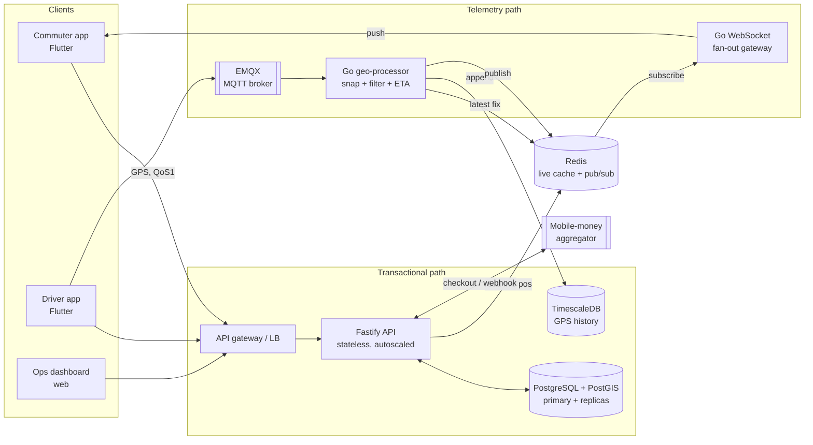
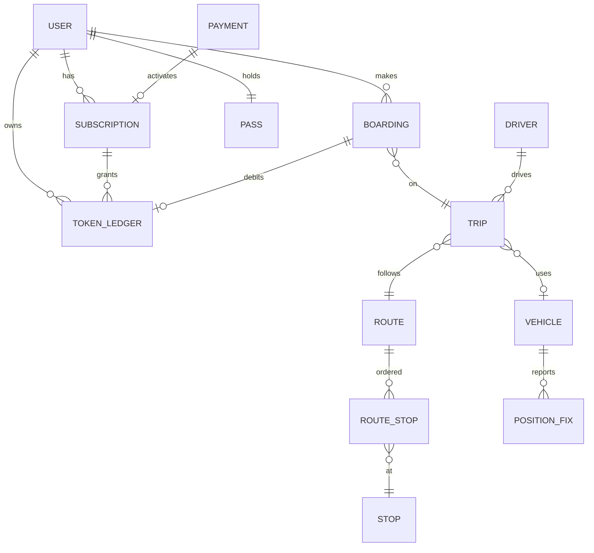
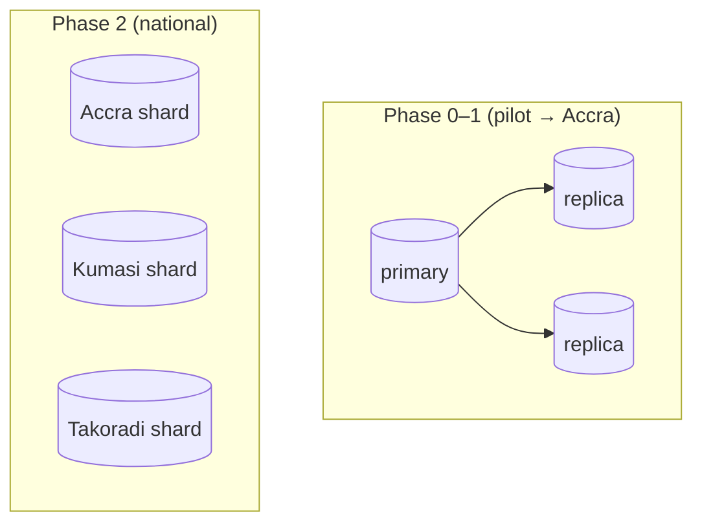
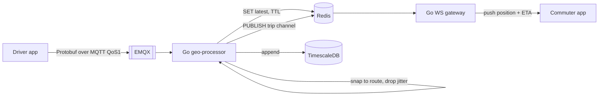

# Trotxi — System Design

**Status:** Draft v1 · **Scope:** the platform behind Volume 4 (Implementation)
· **Companion to:** [architecture.md](architecture.md) and the [ADRs](adr/).

This document turns the strategy in **Volume 4** into a concrete technical
system: data models, database design, caching, telemetry, scaling, reliability,
and maintainability. It is deliberately **phased** to match Volume 4's core
principle — _build while validating, demand-led deployment, validation before
scale_. We do **not** build national-scale machinery during an Accra pilot; we
design interfaces now so each phase slots in without rewrites.

The reasoning draws on _Designing Data-Intensive Applications_ (Kleppmann) for
data modelling, replication/partitioning, and stream processing, and on
_System Design Interview_ (Xu) for the scaling progression and real-time
delivery patterns.

---

## 1. Requirements

### Functional

- **Identity** — riders and drivers register/sign in (phone-first for Ghana, see §10); roles: `commuter`, `driver`, `admin`.
- **Subscriptions & tokens** — a monthly subscription grants ride tokens; tokens are redeemed to board trips.
- **Mobility** — routes, ordered stops, scheduled/active trips, vehicles.
- **Boarding** — one active ride at a time; a unique QR pass per rider verified by the driver; fare deducted in tokens.
- **Payments** — mobile money (MTN / Telecel / AirtelTigo) via an aggregator, with asynchronous confirmation (webhooks).
- **Live tracking** — riders see the vehicle move and an ETA to their stop.
- **Operations** — admins manage routes/trips/vehicles/drivers; analytics drive demand-led expansion.

### Non-functional (the part that shapes the design)

| Property         | Target                                                                                    |
| ---------------- | ----------------------------------------------------------------------------------------- |
| Money integrity  | **Strong consistency.** No double-spend, no lost payment, fully auditable.                |
| Live-map latency | **< 100 ms** end-to-end at scale (eventual consistency is fine here).                     |
| API latency      | p99 < 300 ms for transactional calls.                                                     |
| Availability     | Pilot 99.5% → city 99.9%. Money paths must fail _safe_, not _open_.                       |
| Connectivity     | Ghana: intermittent mobile data, dead zones. Clients buffer; the map degrades gracefully. |
| Devices          | Low-end Android first; data-light payloads.                                               |
| Compliance       | Data Protection Act 843; mobile money via a licensed aggregator (we never hold value).    |

### The defining tension

Two workloads with **opposite** needs share one product:

- **Transactional** (money, boarding) — strong consistency, modest volume, changes weekly.
- **Telemetry** (GPS) — high volume, latency-critical, tolerates staleness.

Designing them together is the central mistake to avoid. We separate them (ADR-0002) and let each scale on its own curve.

---

## 2. Capacity estimates (back-of-envelope)

GPS telemetry dominates everything else by orders of magnitude.

**Telemetry write rate** (1 fix / 3 s per active vehicle):

| Phase    | Vehicles | Writes/s | Raw GPS/day (~60 B/fix) |
| -------- | -------- | -------- | ----------------------- |
| Pilot    | ~50      | ~17      | ~85 MB                  |
| Accra    | ~1,000   | ~330     | ~1.7 GB                 |
| National | ~10,000  | ~3,300   | ~17 GB                  |

**Transactional rate** (100k riders × ~2 rides/day): ~200k boardings/day ≈ **2–3/s average**, with sharp commute peaks (~50–100/s). Payments are lower still (one per rider per month).

**Takeaways that drive the design:**

1. Telemetry needs a **write-optimised, downsampled time-series store** and an in-memory hot path — never the transactional DB.
2. The transactional load is small; **a single primary + read replicas covers Accra comfortably.** Sharding is a _national-phase_ concern, not a pilot one.
3. Reads (browsing routes/trips, watching the map) vastly outnumber writes → **cache aggressively, read from replicas.**

---

## 3. High-level architecture

Two decoupled paths meeting only at Redis (the live-position cache).



During the **pilot** the telemetry path is _not deployed_: the API serves
positions over plain HTTP polling behind the same client contract, so the
engine can be swapped in later without touching the apps (ADR-0006).

---

## 4. Data model

Relational core in PostgreSQL (ACID where money lives, ADR-0005). The single
most important decision:

### 4.1 The token wallet is an append-only ledger, not a balance column

A mutable `token_balance` integer is the classic way to lose money: concurrent
boardings race, a crash mid-update corrupts state, and there is no audit trail.
Instead we model the wallet as an **immutable, double-entry-style ledger**
(DDIA: derived data / event sourcing). Every grant and spend is one row;
**balance is a derived sum**, cached but never the source of truth.



**Ledger entry (the heart of the money system):**

```
token_ledger(
  id            uuid pk,
  user_id       uuid,                 -- partition/shard key
  delta         integer,              -- +100 grant, -1 spend (never zero)
  reason        text,                 -- 'subscription_grant' | 'boarding' | 'refund'
  ref_type      text,                 -- 'payment' | 'boarding'
  ref_id        uuid,
  idempotency_key text unique,        -- exactly-once writes
  created_at    timestamptz
)
-- balance(user) = SUM(delta) WHERE user_id = ?
```

- **No double-spend:** debits use `idempotency_key` (unique) + a guard that the
  derived balance stays ≥ 0, inside one transaction. A retried board request is
  a no-op, not a second charge.
- **Auditability:** the full money history is reconstructable for any user — a
  hard requirement for a financial product and for Act 843.

### 4.2 Payments — idempotent and reconcilable

```
payment(
  id, user_id, reference unique, plan, amount, currency,
  phone, network, provider,
  status,            -- pending | paid | failed  (state machine)
  idempotency_key,   -- provider webhooks retry; we must dedupe
  created_at, updated_at
)
```

Webhooks are **idempotent** (provider may deliver more than once) and a nightly
**reconciliation job** compares our ledger against the aggregator's settlement
report. We never mutate a `paid` payment.

### 4.3 Mobility & geospatial

`routes`, `stops`, `route_stops(seq)`, `trips(status, scheduled_at)`,
`vehicles`. Stops carry a PostGIS `geography(Point)` with a **GiST index** for
"nearest stop / point-along-route" queries. Trips are the join between a route,
a vehicle, and a schedule.

### 4.4 Telemetry (separate store, separate shape)

```
position_fix(                 -- TimescaleDB hypertable, partitioned by time
  vehicle_id, trip_id, ts, lat, lng, speed, heading, accuracy, source
)
```

Time-series, append-only, **downsampled on retention** (raw 7 days → 1-min
aggregates 90 days → drop). The _hot_ latest fix lives in Redis, not here.

### 4.5 Schema evolution

Versioned, idempotent SQL migrations; **only backward-compatible changes**
(add columns/tables, never break readers — DDIA ch4). The GPS wire format uses
**Protobuf** so the driver app and processor can evolve independently.

---

## 5. Database design

### 5.1 Replication & read/write split (DDIA ch5)

- **PostgreSQL primary** takes all writes (boarding, payment, ledger).
- **Async read replicas** serve the read-heavy traffic: browsing routes/trips,
  history, position reads. Tolerable replication lag for these (eventual is fine).
- **Money reads that must be fresh** (balance check during a board) read the
  primary, inside the boarding transaction.
- **PgBouncer** for connection pooling (serverless/edge clients exhaust
  connections otherwise).

### 5.2 Partitioning / sharding — only when national (DDIA ch6)

Mobility is **naturally geo-partitioned**: an Accra trip never touches Kumasi
data. So the shard key, _when needed_, is **city/region** — which keeps almost
every transaction inside one shard (no distributed transactions). Until then, a
single primary + replicas is simpler and sufficient. We avoid premature
sharding precisely as Volume 4 prescribes.



### 5.3 Polyglot persistence

| Store                 | Holds                                                              | Why                                                                                   |
| --------------------- | ------------------------------------------------------------------ | ------------------------------------------------------------------------------------- |
| PostgreSQL+PostGIS    | users, money, mobility, geo                                        | ACID + spatial; system of record                                                      |
| TimescaleDB           | GPS history                                                        | Postgres extension → one ops surface; fast time-range queries + continuous aggregates |
| Redis                 | live positions, sessions, cache, pub/sub, rate limits, idempotency | sub-ms, ephemeral                                                                     |
| ClickHouse (national) | analytics / demand modelling                                       | columnar; off the hot path                                                            |

---

## 6. Caching strategy

Redis earns its place in five distinct roles — keep them logically separate:

1. **Live position cache** — `trip:{id}:pos` → latest fix, TTL ~30 s. The map
   reads this, never the DB. Falls back to simulated/last-known on miss
   (graceful degradation, already in the prototype).
2. **Read-through reference cache** — routes, stops, trip schedules change
   rarely. Cache-aside with explicit invalidation on admin edits.
3. **Derived token balance** — `bal:{user}` materialised from the ledger;
   invalidated on every credit/debit. Source of truth stays the ledger, so a
   stale/empty cache is safe (recompute from `SUM(delta)`).
4. **Sessions / refresh tokens & rate limiting** — fast auth checks and abuse
   control at the edge.
5. **Idempotency keys & pub/sub** — dedupe window for webhooks; the bridge
   between telemetry ingest and WebSocket fan-out.

**Map tiles & static assets** sit behind a CDN, not Redis.

Cache invalidation rule of thumb: cache things that are read far more than
written (reference data, positions); for money, cache only _derived_ values you
can always recompute.

---

## 7. Telemetry pipeline (the latency-critical path)



Design choices (DDIA stream processing ch11; Xu real-time/WebSocket):

- **MQTT over HTTP for GPS** — 2-byte headers and **QoS 1 store-and-forward**
  survive dead zones; the phone buffers and replays when signal returns.
- **Go on the hot path** — goroutines make tens of thousands of concurrent
  sockets cheap with predictable, GC-friendly latency.
- **Decouple ingest from delivery** via Redis pub/sub (Kafka at national scale)
  so a burst of riders watching never backpressures GPS ingestion.
- **Out-of-order & duplicates** — fixes carry event-time `ts`; the processor
  dedupes on `(vehicle_id, ts)` and ignores fixes older than the last known
  (event time ≠ processing time).
- **ETA** — the processor keeps per-trip state (progress along route) and pushes
  ETA-to-stop, the question riders actually ask, computed from data we already
  have.
- **WebSocket fan-out scales horizontally** — gateways are stateless w.r.t.
  membership; Redis pub/sub (or Kafka) delivers to whichever node holds a given
  rider's socket. Connection distribution via consistent hashing (Xu ch5).

### Kafka, later

At national scale a **durable event log** (Kafka) becomes the backbone:
telemetry _and_ domain events (`boarding.created`, `payment.paid`) flow through
it, letting analytics, demand forecasting, and notifications consume
independently — the "unbundling the database" pattern (DDIA ch12). Not built
until pilot data justifies it.

---

## 8. Scaling roadmap (mapped to Volume 4 phases)

The architecture is intentionally staged so engineering spend tracks validated
demand — the literal translation of Volume 4 §1.4–1.5.

| Phase            | Volume 4 stage                        | What we run                                                                                                              | What we deliberately skip                             |
| ---------------- | ------------------------------------- | ------------------------------------------------------------------------------------------------------------------------ | ----------------------------------------------------- |
| **0 — Pilot**    | Validate before scale (2–3 corridors) | Modular monolith API + managed Postgres + Redis; **HTTP polling** for positions; mobile-money sandbox→live               | Telemetry path, replicas, sharding, Kafka, ClickHouse |
| **1 — Accra**    | Demand-led city rollout               | Stateless API behind LB (autoscale); **read replicas + cache**; **turn on MQTT→Go→WS** telemetry; CDN; multi-AZ Postgres | Sharding, Kafka, separate analytics DB                |
| **2 — National** | Repeatable expansion model            | **Geo-shard by city**; **Kafka** event backbone; TimescaleDB cluster; **ClickHouse** analytics via CDC                   | —                                                     |

The golden rule (Xu ch1, restated for us): **add a tier only when a measured
bottleneck demands it.** The prototype's 3-second polling is indistinguishable
from a sub-100 ms pipeline at pilot scale — so we don't build the pipeline yet.

---

## 9. Reliability

### Money must fail safe

- **No double-spend:** ledger debit + balance guard in one serializable
  transaction; idempotency keys make retries no-ops.
- **No lost payment:** idempotent webhooks; payment is a state machine
  (`pending → paid|failed`), never mutated once `paid`; nightly reconciliation
  vs the aggregator.
- **Degrade safe:** if the payment provider is down, boarding with _existing_
  tokens still works; only new top-ups block. Circuit-breaker + backoff around
  the aggregator.

### Failure modes & responses

| Failure               | Response                                                                           |
| --------------------- | ---------------------------------------------------------------------------------- |
| Driver loses signal   | MQTT QoS1 buffers on device; map shows last-known/simulated; recovers on reconnect |
| Redis live-cache miss | Fall back to TimescaleDB last fix, then simulated                                  |
| Primary DB fails      | Multi-AZ standby with automatic failover; PITR backups (restores tested)           |
| WS gateway dies       | Client reconnects; another node picks up via Redis pub/sub                         |
| Telemetry flood       | Pub/sub decoupling + backpressure; ingestion never blocks the API                  |

### Operational guardrails

- `/healthz` (liveness) + `/readyz` (DB-aware) gate traffic; graceful shutdown.
- **SLOs with error budgets** (e.g. live-map freshness, board success rate).
- Encryption in transit + at rest; PII minimised; audit log on money mutations
  (Act 843). Data residency revisited as we scale (regional hosting).

---

## 10. Maintainability

Operability, simplicity, evolvability — the three maintainability pillars
(DDIA ch1).

- **Simplicity — modular monolith first.** One Fastify service (routes →
  services → repositories, DI via `buildApp(deps)`), split into services **only
  when justified**. The telemetry path is the _first_ justified split: different
  latency profile and language (Go). Resist premature microservices.
- **Evolvability** — repository pattern (in-memory ↔ Postgres), versioned
  migrations, API versioning, ADRs as the decision record, Protobuf for the
  telemetry contract so producer/consumer evolve independently.
- **Operability — observability from day one:** structured logs, RED/USE
  metrics, OpenTelemetry traces, dashboards, alerts on SLOs.
- **Testing as a gate** — unit (services), integration (repos + real Postgres),
  **e2e journeys** (already in CI), and load tests for the telemetry path before
  Phase 1. Every push runs format + lint + typecheck + tests; `main` is protected.

### Identity note (open decision)

Ghana is phone-first; **phone + OTP** (via an SMS aggregator) is likely the
primary login, not email/password. Native apps use **Bearer tokens in secure
device storage** with **short-lived access + rotated, revocable refresh tokens**
(a `sessions` table) — so a lost phone or suspended driver can be cut off fast.
This is the next ADR to write (see the reference saved on auth architecture).

---

## 11. Decision summary

| Area          | Decision                                                                      | Rationale                                            |
| ------------- | ----------------------------------------------------------------------------- | ---------------------------------------------------- |
| Money model   | **Append-only token ledger**, derived balance                                 | Auditability + no-lost-update; financial correctness |
| Consistency   | Strong for money, eventual for positions                                      | Match each workload's real need                      |
| Telemetry     | MQTT(QoS1) → Go → Redis → WS, Protobuf                                        | Survives dead zones; sub-100 ms; cheap fan-out       |
| Time-series   | TimescaleDB + Redis hot cache                                                 | One ops surface; fast ranges; in-memory latest       |
| DB scaling    | Replicas first; **geo-shard by city** only at national scale                  | Mobility is geo-partitioned; avoid distributed txns  |
| Caching       | Redis for positions/reference/derived-balance/sessions/pub-sub; CDN for tiles | Read ≫ write; recomputable money cache               |
| Service shape | Modular monolith; Go telemetry as first split                                 | Simplicity until a bottleneck justifies a split      |
| Rollout       | Phase the infra to Volume 4's demand-led stages                               | Don't pay for national scale during a pilot          |

## 12. Open questions

1. Phone-OTP vs email/password at launch (and which SMS aggregator).
2. Payment aggregator: Paystack vs Hubtel (fees, settlement, PostGIS-irrelevant but webhook reliability matters).
3. Data residency: when does Act 843 force in-country/regional hosting?
4. Driver↔vehicle↔trip assignment model (also closes a current security gap: any driver can report any trip's position).
5. ETA model: deterministic (progress along route) for Phase 1 vs learned (historical travel times) later.
